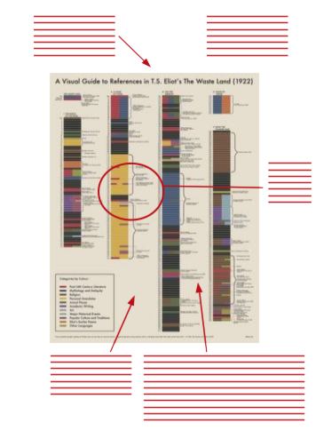
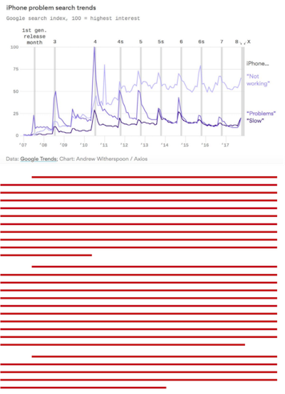

## Consigne

À partir du graphique suivant:


1. Produisez une critique constructive du graphique. Présentez-en les atouts et les défauts.
    
    _Vous présenterez votre réflexion à la manière d'un dessin d'observation._ \newline{}
    

2. À la lumière de votre travail critique, proposez une visualisation alternative des données.
    
    _Sur une page A4, vous présenterez votre visualisation, et l'accompagnerez d'un court paragraphe argumentatif. Le graphique doit être autonome: le commentaire qui l'accompagne ne concerne pas la lecture du graphique ou son interprétation, mais doit justifier votre démarche et défendre vos propositions d'amélioration._ \newline{}
    
    
    **Remarques:** _Si, pour des raisons justifiées en première partie, vous estimez qu'un nouvel agencement ne garantit en rien une meilleur lisibilité des données, vous reproduirez le graphique initial au plus près._
    
    _Vous réaliserez vos graphiques avec R. Vous êtes encouragés à utiliser [R markdown](https://rmarkdown.rstudio.com), et à commenter les différentes étapes de la création (idées, essais, erreurs). Dans tous les cas vous communiquerez votre code, qui doit être le plus lisible possible._
    
    _Il vous appartient de collecter les données pour la reproduction du graphique. Si vous ne parvenez pas à retrouver les données d'origine, vous pouvez:_
    
    - _lire les données (tout simplement!)_
    - _utiliser un logiciel de *retro-ingineering* _
    - _utiliser des données approchantes (ex: données sur la France à la place de l'Allemagne)_
    - _utiliser des données générées aléatoirement_
    
    _Dans tous les cas, vous communiquerez les données et commenterez dans le code comment vous les avez obtenues. N'hésitez pas à me consulter (arthur.katossky@ensai.fr) si vous vous trouvez dans l'impasse._

Le devoir est à rendre **avant le jeudi 25 février à midi** en deux exemplaires:

- une version papier A4 recto-verso couleur à remettre à la scolarité
- une version numérique au format PDF à remettre par mail au correcteur de votre groupe (voir ci-dessous), avec moi en copie (arthur.katossky@ensai.fr) — l'objet de votre mail et le nom de votre PDF seront tous deux: "DM Visulisation de données avec R - Groupe X"


```{r setup, echo=FALSE, warning = FALSE, message = FALSE}
library(tidyverse)
library(knitr)
library(kableExtra)
knitr::opts_chunk$set(fig.width=8, out.width='100%', fig.height=4)
```

```{r, echo=FALSE}
students <- str_split("gertrude-yaka.tine@eleve.ensai.fr, louison.thomas-billot@eleve.ensai.fr, luxin.huang@eleve.ensai.fr, quentin.ruhier@eleve.ensai.fr, maxime.heuillet@eleve.ensai.fr, antoine.rault@eleve.ensai.fr, oumaima.hessane@eleve.ensai.fr, florian.givernaud@eleve.ensai.fr, leo.gillette@eleve.ensai.fr, cynthia.gilles@eleve.ensai.fr, paul.gehin@eleve.ensai.fr, bruno.garoche@eleve.ensai.fr, kevin.garcia@eleve.ensai.fr, wafa.gabouj@eleve.ensai.fr, sidney.forget@eleve.ensai.fr, mathilde.elimas@eleve.ensai.fr, celine.duval@eleve.ensai.fr, kadidjatou.diambo@eleve.ensai.fr, charles.deulin@eleve.ensai.fr, clement.delecourt@eleve.ensai.fr, baptiste.criniere-boizet@eleve.ensai.fr, habib.coulibaly@eleve.ensai.fr, juliette.clemmer@eleve.ensai.fr, antoine.chollet@eleve.ensai.fr, fabien.chapouillie@eleve.ensai.fr, sebastien.biju-duval@eleve.ensai.fr, francois.beudin@eleve.ensai.fr, mariem.becan-roux@eleve.ensai.fr, augustin.baron@eleve.ensai.fr, simon.barbier@eleve.ensai.fr, ulrich.akana-nagou@eleve.ensai.fr, sami.ahedda@eleve.ensai.fr, baptiste.archambaud@eleve.ensai.fr, killian.poulain@eleve.ensai.fr, muriella.rakotobe@eleve.ensai.fr, david.audenaert@eleve.ensai.fr, mathieu.petit@eleve.ensai.fr, tino.pele@eleve.ensai.fr, marius.pele@eleve.ensai.fr, giorgia.pandolfi@eleve.ensai.fr, victor.pain@eleve.ensai.fr, xavier.ossonce@eleve.ensai.fr, lola.noyelle@eleve.ensai.fr, lin.mei@eleve.ensai.fr, julie.mansard@eleve.ensai.fr, hugo.luttenauer@eleve.ensai.fr, mathilde.letouq@eleve.ensai.fr, basile.leroux@eleve.ensai.fr, lola.lercari@eleve.ensai.fr, francois-xavier.lepine@eleve.ensai.fr, arthur.lepan@eleve.ensai.fr, hugues.ravier@eleve.ensai.fr, alexis.lemperiere@eleve.ensai.fr, mathilde.niay@eleve.ensai.fr, clement.lefebvre@eleve.ensai.fr, ines.karmous@eleve.ensai.fr, jorge.del-romero-raposo@eleve.ensai.fr, david.fath@eleve.ensai.fr, paul.lafleur@eleve.ensai.fr, paul.zedam@eleve.ensai.fr, armelle.koehl@eleve.ensai.fr, allan.vitre@eleve.ensai.fr, wend-kouni-christophe.kientega@eleve.ensai.fr, alexandre.vareille@eleve.ensai.fr, serge.kajie@eleve.ensai.fr, valerie.vanelle@eleve.ensai.fr, alima.kaba@eleve.ensai.fr, boubacar.traore@eleve.ensai.fr, lucile.jamet@eleve.ensai.fr",  pattern=", ", simplify = TRUE)

set.seed(874110L)
groups <- students %>% .[1,] %>% tibble(Élève=.) %>%
  sample_n(., size=nrow(.)) %>%
  mutate(
    Groupe = (1:n()+1)%/%2,
    Groupe = ifelse(Groupe==35, sample(Groupe[-length(Groupe)], 1), Groupe),
    Correcteur = Groupe %/% 9 + 1,
    Correcteur = c("contact@colinfay.me", "jordan.tremoureux@gmail.com", "remi.pepin@insee.fr", "arthur.katossky@ensai.fr")[Correcteur]
  ) %>% arrange(Groupe)
```

## Tableau des groupes

_Les groupes ont été générés aléatoirement. J'attends de vous que vous sachiez travailler avec des personnes variées, et c'est pourquoi je vous ai affecté indépendamment de vos affinités._

**Remarque:** _S'il devait arriver que votre binome fonctionne mal, ne laissez pas la situation pourrir jusqu'à la veille du rendu. Contactez une tierce personne au plus vite (moi ou une personne de confiance) pour tenter une médiation et trouver une solution acceptable. Sans entrer dans le détail, et en restant les plus bienveillants possibles, tenez-moi informé de ces éventuelles difficultés._

```{r, echo=FALSE, warning=FALSE}
groups %>%
  group_by(Correcteur) %>% mutate(
      Correcteur2 = ifelse(1:n()==1, Correcteur, '')
  ) %>%
  ungroup %>% group_by(Groupe) %>% mutate(
      Groupe2 = ifelse(1:n()==1, as.character(Groupe), '')
  ) %>%
  ungroup %>%
  select(Correcteur = Correcteur2, Groupe = Groupe2, Élève) %>% 
  kable(longtable = T, booktabs = T, escape=F, linesep = "") %>%
  kable_styling(latex_options = c("repeat_header"))
```

## Tableau des élèves

_Adresses mail par ordre alphabétique._

```{r, echo=FALSE}
groups %>% select(Élève, Groupe) %>%
  mutate(Groupe = as.factor(Groupe)) %>%
  arrange(Élève) %>%
  kable(longtable = T, booktabs = T, escape=F, linesep = "") %>%
  kable_styling(latex_options = c("repeat_header"))
```