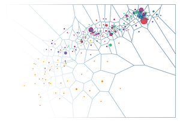

## Consigne

Voici le code d'une reproduction du Gapminder: https://codepen.io/katossky/pen/WmEKrq [^1]

- Par groupes de 2 à 4 élèves de votre choix et du même groupe de TP, vous devez expliquer le code précédent (partie 1) et proposer des améliorations du graphique (partie 2).
- Votre devoir doit être rendu par mail avant le vendredi 26 avril à 14h à votre chargé de TP, avec moi en copie (arthur.katossky@ensai.fr). L'objet de votre mail sera: "DM Visualisation de données avec d3.js - Nom1, Nom2, etc.".
- Le mail contient un lien vers un CodePen contenant votre graphique, et un PDF contenant vos réponses à la première partie, accompagnées d'éventuels commentaires pour la seconde partie.
- Le devoir est noté sur 20, avec 2 points de bonus.

[^1]: ... inspiré par Mike Bostock: https://bost.ocks.org/mike/nations/

### Partie 1. Explication de code (6 points)

1. Listez les 5 interactions possibles pour l'utilisateur. Lesquelles sont codées en CSS?
2. Quelles lignes de code permettent de réaliser chacune de ces interactions?
3. Pourquoi les abonnements des lignes 207-2010 sont-ils isolés des abonnements des lignes 200-203 dans une fonction `set_up_listeners()`?
4. Réalisez un schéma illustrant le déclenchement successif des événements dans l'application chargée. (On ne considérera donc pas l'événement `data_ready` et ses successeurs.)
5. Quelle est la syntaxe en pur JavaScript équivalente aux lignes 6, 186, 191 et 192 ?
6. Expliquez l'utilisation de `transition()` aux lignes 153 et 159 et de `d3.interval()` ligne 182.

### Partie 2. Extensions (16 points)

Dans un CodePen unique, réalisez 1 extension simple, 1 extension intermédiaire et 1 extension avancée au choix parmi les suivantes.

Vous commenterez votre code autant que nécessaire (1 point). Vous veillerez à préserver autant que se peut l'organisation générale du code: style en CSS[^2], déclarations regroupées en fin de document, abonnements regroupés en fin de document, etc. (1 point).

N'hésitez pas à consulter la documentation (https://github.com/d3/d3/blob/master/API.md, https://developer.mozilla.org/fr/docs/Web/JavaScript, https://www.w3schools.com/Css, etc.), et de vous aider d'un moteur de recherche. N'oubliez pas la fonction "Inspecter" (Chrome) / "Examiner" (Firefox) de votre navigateur, et notamment l'onglet "Eléments" / "Inspecteur" (qui décrit le DOM dans son état courant) et l'onglet "Console" (pour les messages d'erreur).

Toute trace de recherche sera valorisée.

2 points sont donnés à des améliorations libres du graphique, dont vous expliquerez la teneur.

**Extensions simples:** (4 points, _Ne réinventez pas la poudre!_)

1. Passez l'axe des x en échelle logarithmique. Vous éviterez les notations scientifiques.
2. Rajoutez une seconde glissière qui permette de régler le rayon maximal des cercles.
3. Rajoutez une seconde glissière qui permette de régler la vitesse d'animation.
4. Rajoutez une section "paramètres" dans la barre de contrôle, qui n'apparaît que lorsque l'on clique sur une icône appropriée (ex: engrenages). Vous y placerez un texte factice du type "La section paramètres est en construction." ou une image.

**Extensions intermédiaires:** (4 points)

5. Ajoutez un bouton stop à côté du bouton play. Appuyer dessus arrête l'animation. Cliquer sur la barre de défilement interrompt également l'animation.
6. Excluez définitivement les pays avec des valeurs manquantes.
7. Ajoutez un cartouche à un endroit libre de la zone graphique. Le cartouche contient le nom du pays survolé, sa population, son revenu et ses émissions CO2 (ou son espérance de vie, en fonction de ce qui est représenté à ce moment sur le graphique).
8. Offrez l'option de passer les émissions CO2 en échelle logarithmique, à l'aide d'une case à cocher. Les points doivent se déplacer à leur nouvel emplacement, comme lorque l'on passe de "Espérance de vie" à "Émissions de CO2". (non compatible avec 1)

**Extensions avancées:** (4 points)

9. Faites disparaître avec une animation pertinente (_fade-in_/_fade-out_ par exemple) les pays avec des valeurs manquantes, lorsque celles-ci empêchent une représentation correcte. Par exemple, Nauru 2010 a une espérance de vie inconnue, alors qu'on connait ses émissions de CO2. Lorsque l'on passe à la vue "émissions CO2", Nauru doit aparaître au bon endroit, puis disparaître lorsque l'on passe à la vue "espérance de vie". (non compatible avec 5)
    
    **_Pistes_:** utilisez les méthodes `enter()`, `merge()` et `exit()` à la place de `join()`, comme exposé ici: https://bl.ocks.org/mbostock/3808218 et là: https://bost.ocks.org/mike/join

10. Implémentez un masque transparent de Voronoï (https://fr.wikipedia.org/wiki/Diagramme_de_Vorono%C3%AF). Les actions qui se passaient au niveau du disque (survol, click) sont désormais déclenchées au niveau de la cellule de Voronoï correspondante.
    
    **_Pistes_:** https://github.com/d3/d3-voronoi, https://mbostock.github.io/d3/talk/20111116/airports.html  
    

 <!-- https://www.visualcinnamon.com/2015/07/voronoi.html -->

11. N'affichez au départ que la moitié des pays, sélectionnés aléatoirement. Les pays restants peuvent être ajoutés à l'aide d'un menu déroulant placé dans la zone de contrôle. Les pays sélectionnés peuvent être retirés via un bouton "Supprimer", placé dans une zone fixe et vide du graphique. Ce bouton (rouge, avec une icone de poubelle ou une croix, arborant le texte "supprimer") n'apparaît que lorsqu'au moins un pays est sélectionné.

[^2]: vous priviligierez donc quand vous le pouvez la modification de l'aspect des éléments du graphique via leur classe, plutôt que directement via leurs propriétés