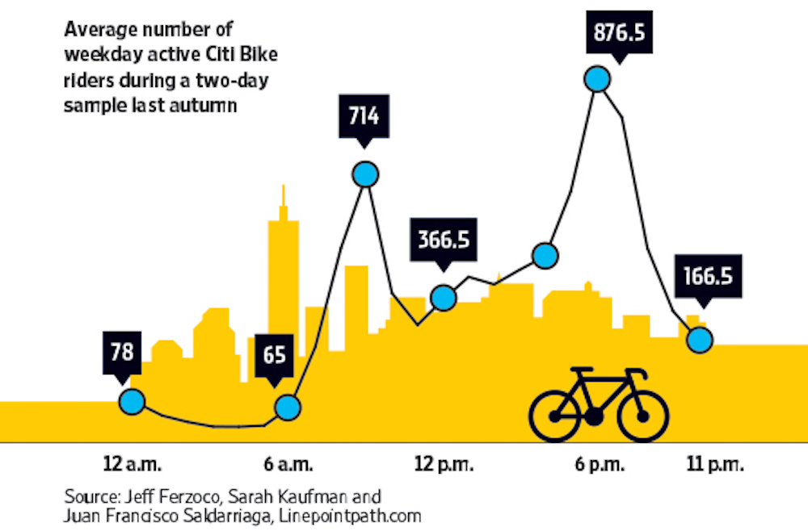
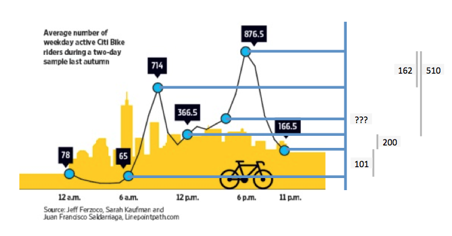
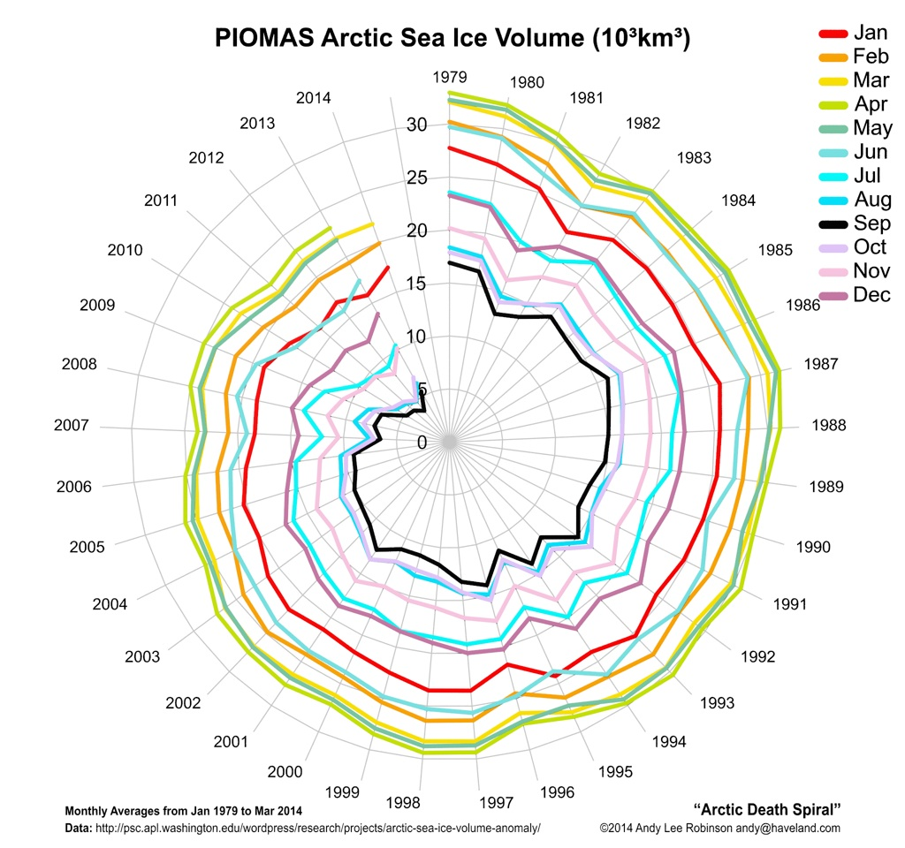
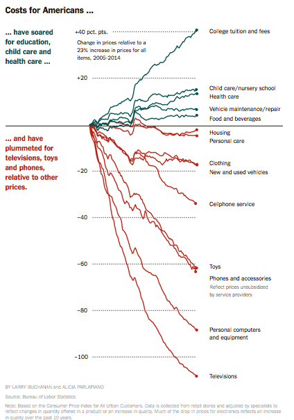
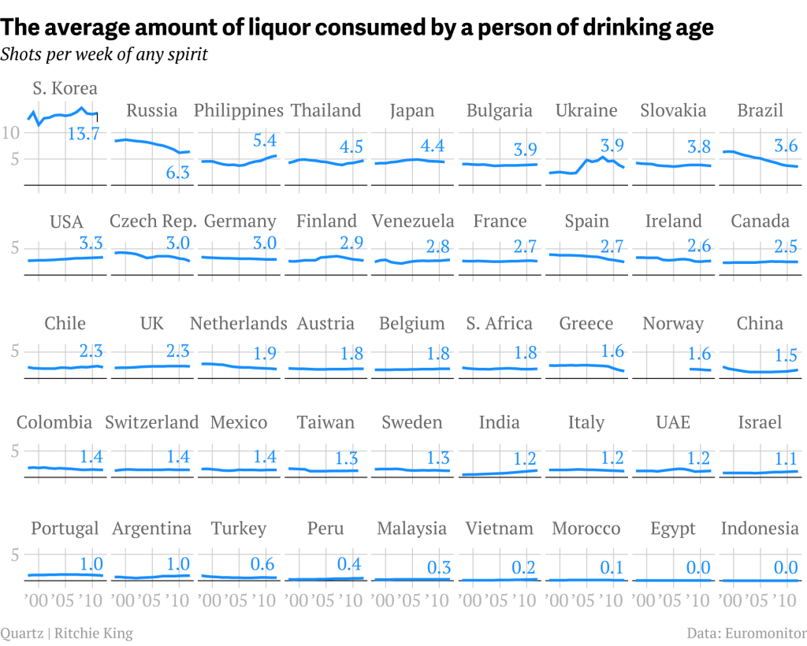
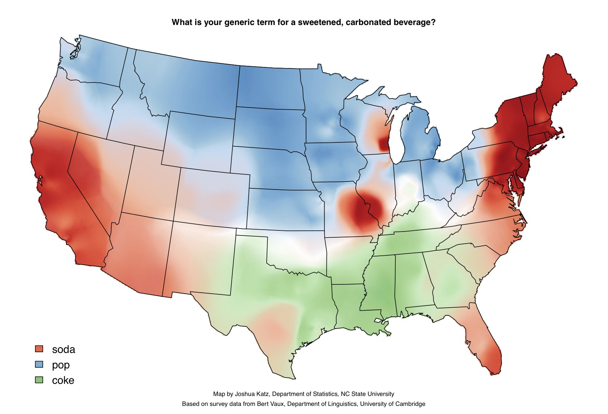
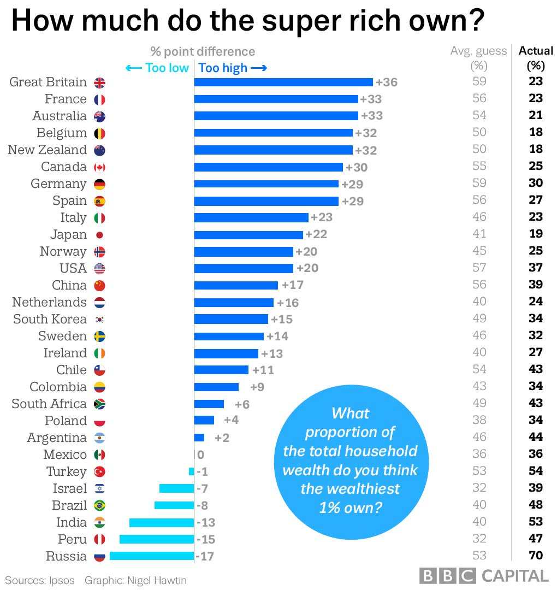
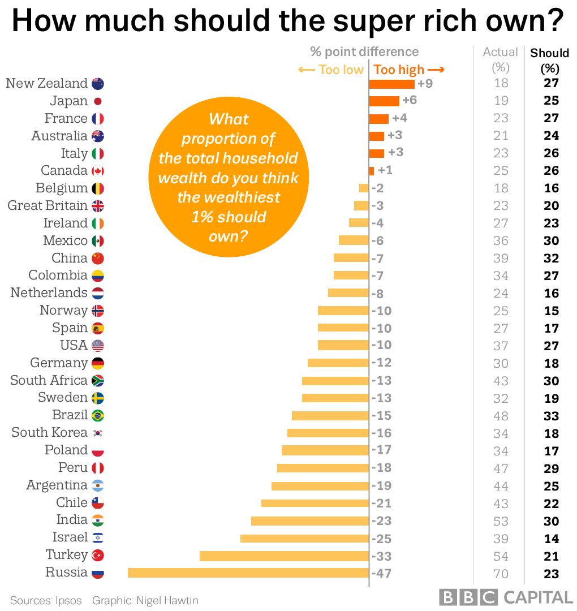

```{r setup, echo=FALSE, warning = FALSE, message = FALSE}
library(tidyverse)
knitr::opts_chunk$set(fig.width=8, out.width='100%', fig.height=4)
# TO DO:
# - remplacer les données simmulées de la question 3.3 par des données réelles
# - remplacer les citations par un environnement "correction"
# - enlever les points à la fin des titres
# - trick to embed backticks inside R expressions
# - critique de graphique:
#   - add a Venn diagram
#   - autres questions sur les graphiques Q: le titre est-il clair? (y a-t-il un titre?) ; y a-t-il des commentaires pour aider la lecture? des annotations? V: test d'autosuffisance ; D: les données sont-elles accessibles? sont-elles produites par un organisme fiable? selon quelle méthode? ; coquilles et imperfections ; adapté à l'audience, adapté au medium de publication (longs graphiques pour le web, graphique photococipable, etc.) ; re-discuter de la notion d'efficacité
```

## Introduction `r if(rmarkdown::metadata$version=='professeur') "~ 10 min."`

Les premières sections de cette introduction sont fortement inspirée du chapitre introductif de Munzner (2014).

### La visualisation de données, une représentation _visuelle_

La visualisation repose sur la vision car c'est le sens le plus adapté comme support de mémoire externe:

- \dotfill
- \dotfill
- \dotfill
- \dotfill

`r if(rmarkdown::metadata$version!='professeur') "\\begin{comment}"`
> parallélisation inconsciente du traitement ; perception simmultanée ; zones cérébrales spécialisées et développées ; possibilité technique (écrans, imprimerie)"
`r if(rmarkdown::metadata$version!='professeur') "\\end{comment}"`

### Une représentation _complexe_

La visualisation présente des données les plus désagrégées possibles, pour ne pas tomber dans le piège de la synthèse (**Figure 1**).


Ce n'est évidemment pas toujours possible quand les données deviennent beaucoup trop nombreuses. Mais l'idée est d'utiliser les avantages de la vision pour transmettre beaucoup plus d'information que ce qu'il est possible de proprement _comprendre_.

### Une représentation _efficace_

La visualisation se distingue du design, de la publicité ou de l'art par \dotfill \newline .\dotfill \newline .\dotfill

`r if(rmarkdown::metadata$version!='professeur') "\\begin{comment}"`
> ... son intérêt pour l'efficacité de la représentation à communiquer une information ; nous ne poserons donc pas la question de savoir si un graphique est "joli" mais de s'il "fonctionne".
`r if(rmarkdown::metadata$version!='professeur') "\\end{comment}"`

Malheureusement \dotfill \newline .\dotfill \newline .\dotfill

`r if(rmarkdown::metadata$version!='professeur') "\\begin{comment}"`
> ... la notion d'efficacité est très floue, et dépend des tâches envisagées. Et les tâches possibles sont très nombreuses. S'agit-il de marquer l'esprit? (provoquer l'arrête d'un passant ; placer une information en mémoire du lecteur pour le plus longtemps possible) De lire précisément un chiffre? (minimiser l'erreur de lecture) De favoriser l'amusement et la découverte? (garder un utilisateur captif le plus longtemps possible, maximiser son bien-être ressenti) Etc. Parfois, il est même très malaisé de définir un objectif mesurable, comme lorsque les graphiques nous servent à écouvrir des régularités précédemment inconnues, de détecter des tendances, etc.
`r if(rmarkdown::metadata$version!='professeur') "\\end{comment}"`

Dans ce cours, nous nous intéresserons surtout à \dotfill \newline .\dotfill \newline .\dotfill \newline

`r if(rmarkdown::metadata$version!='professeur') "\\begin{comment}"`
> ... la tâche de comparer des grandeurs dans des graphiques finis, c'est-à-dire publiables. D'un côté parce que la comparaison est une tâche fondamentale (elle conditionne, par exemple, la découverte de régularités). De l'autre parce que c'est l'une de plus étudiées.
> 
> Cela laisse malheureusement un immense pan du travail du statisticien, les graphiques à des fins d'exploration, qui n'est que très peu étudiée. (Cependant, connaître les conditions d'une d'une comparaison visuellement efficace nous aide déjà énormément dans cette tâche.)
`r if(rmarkdown::metadata$version!='professeur') "\\end{comment}"`

Mais même avec une tâche précise et avec une bonne définition de "l'efficacité" d'une visualisation pour cette tâche, il est extrêmement difficile/fastidieux de "valider" une visualisation. Aussi, les informations expérimentales sur la visualisation sont plutôt rares.

### Une représentation subjective

\dotfill \newline .\dotfill \newline .\dotfill \newline .\dotfill \newline

`r if(rmarkdown::metadata$version!='professeur') "\\begin{comment}"`
> Malgré sa focale sur l'efficacité, il est illusoire de penser que la visualisation est exempte de tout biais, puisque la critique montre que même des disciplines aussi "objectives" que la photographie et la cartographie sont tout autant des propositions que des descriptions (le photographe choisit quoi mettre de dans le cadre, le cartographe une projection, des figurés, etc.).

> Dans ce cours, je vous propose d'assumer constamment votre subjectivité, notamment en choissant des titres clairs et qui véhiculent un message, plutôt que de vous cacher derrière une objectivité en toc.
`r if(rmarkdown::metadata$version!='professeur') "\\end{comment}"`

### `ggplot` et `tidyverse`

Nous utiliserons dans ce cours la bibliothèque `ggplot2`, inspiré de _The Grammar of Graphics_ (Wilkinson, 2005), qui permet de réaliser des graphiques d'une étonnante richesse, tout en gardant un code clair.

Cette bibliothèque fait partie de la série de bibliothèques `tidyverse`, maintenue et développée les programmeurs de RStudio, au premier rang desquels Hadley Wickham. Ces bibliothèques rendent plus cohérentes de nombreuses fonctionsde R-base, qui fonctionnaient jusqu'alors selon chacune leur logique propre. La plupart étant transparentes pour l'utilisateur, je les utilise sans le mentionner explicitement. Mais n'hésitez pas à me poser des questions sur des fonctions qui vous sont inconnues.

La seule nouveauté sur laquelle je vais insister dès maintenant, c'est la notation `%>%` (aka _pipe_), qui permet de remplacer:

- `f(x)` par `x %>% f` et
- `f(x,a)` par `x %>% f(a)`.

Cela paraît un peu ridicule à premier abord (c'est plus long!), mais cela permet de faire de très longues chaînes de fonctions qui, si les fonctions ont été pensées pour, sont très lisibles.

Par exemple `paste0(rev(toupper(letters)), collapse='')` devient:

`letters %>% .......................................................`

`r if(rmarkdown::metadata$version!='professeur') "\\begin{comment}"`
> `letters %>% str_to_upper %>% rev %>% str_c(collapse='')`
> 
> 1. C'est plus conforme à l'ordre logique.
> 2. Notez les fonctions `str_...` de la bibliothèque `tidyverse` qui remplacent toutes les fonctions ayant trait aux chaînes de caractères.
`r if(rmarkdown::metadata$version!='professeur') "\\end{comment}"`

### Les données

Nous travaillerons avec des données Eurostat, principalement des données de population au niveau NUTS 2 (le découpage officiel statistique européeen, qui possède 3 niveaux). Le tableau de données `NUTS2_year` possède une ligne par région NUTS 2 et par année d'observation:

```{r, echo=FALSE}
load('data/NUTS2_year.RData')
NUTS2_year
```

## 1. Faire un graphique avec `ggplot2` `r if(rmarkdown::metadata$version=='professeur') "~ 15 min."`

### 1.1 Graphique basique

Commençons par un exemple: l'évolution de la population en Champagne-Ardenne et en Picardie entre 1990 et 2015.

```{r 1-1-graphique-basique, echo=TRUE}
NUTS2_year %>%
  filter(nom %in% c('Champagne-Ardenne', 'Picardie')) %>%
  ggplot(aes(x=année, y=population)) +
  geom_line(aes(group=nom))
```

Le code du plus simple graphique `ggplot2` possède trois parties:

1. `data %>% ggplot(...)`: \dotfill
    
    `r if(rmarkdown::metadata$version!='professeur') "<!--"`  
    > J'appelle la fonction `ggplot()` sur les données.
    > La fonction `ggplot()` seule ne produit pas de graphiques, mais crée un objet `ggplot`.
    `r if(rmarkdown::metadata$version!='professeur') "-->"`
    
    Notez que `data %>% ggplot(...)` est la même chose que `ggplot(data, ...)`, mais cela est plus lisible quand comme ici je transforme mes données à la vollée avec `filter`. Ainsi:
    ```{r, eval=FALSE, echo=TRUE}
    NUTS2_year %>% filter(nom %in% c('Champagne-Ardenne', 'Picardie')) %>% ggplot
    ```
    ... est l'équivalent en R-base de:
    ```{r, eval=FALSE, echo=TRUE}
    ggplot(............................................................................)
    ```
    `r if(rmarkdown::metadata$version!='professeur') "<!--"`  
    > ```{r, eval=FALSE, echo=TRUE}
    > ggplot(NUTS2_year[NUTS2_year$nom %in% c('Champagne-Ardenne', 'Picardie'), ])
    > ```
    `r if(rmarkdown::metadata$version!='professeur') "-->"`
    
2. `aes(...)`: \dotfill
    
    `r if(rmarkdown::metadata$version!='professeur') "<!--"`  
    > La fonction `aes()` — comme _æsthetics_ — permet de préciser quelles variables vont être utilisées dans la production du graphique, et quels paramètres (position, forme, couleur, etc.) vont dépendre de quelles variables.
    > Ici, les années seront en abscisse (`x=année`), la population en ordonnée (`y=population`).
    > `aes()` peut-être spécifiée dans la fonction `ggplot()` mais aussi individuellement pour chaque couche.
    `r if(rmarkdown::metadata$version!='professeur') "-->"`
    
    Les paramètres graphiques spécifiés dans `ggplot()` sont valables pour **tout** le graphique.
    
3. `geom_...(...)`: \dotfill
    
    `r if(rmarkdown::metadata$version!='professeur') "<!--"`  
    > Enfin, j'ajoute à l'_objet_ `ggplot` issu de la _fonction_ `ggplot()` une fonction qui, elle, va indiquer quel type de graphique produire. Une telle fonction commence généralement par le préfixe `geom_...`, et je la sépare de l'appel à la fonction `ggplot()` par un `+`.
    > Ici, les années seront en abscisse (`x=année`), la population en ordonnée (`y=population`).
    > `aes()` peut-être spécifiée dans la fonction `ggplot()` mais aussi individuellement pour chaque couche.
    `r if(rmarkdown::metadata$version!='professeur') "-->"`
    
    Chaque fonction `geom_...` produit une nouvelle couche (_layer_) contenant les figures (_geometries_) indiquées par le suffixe de la fonction. Ici, `geom_line` produit des lignes (_lines_). Les fonctions graphiques réutilisent les paramètres fournis dans l'argument `aes()` de la fonction `ggplot()`, ici les coordonnées `x=année` et `y=population`. Mais chaque couche peut avoir en sus ses propres paramètres graphiques additionnels. Ici, tous les points correspondant à une même région NUTS 2 (`group=nom`) seront reliés entre eux par des segments, constituant ainsi une ligne.

`r if(rmarkdown::metadata$version!='professeur') "<!--"`  
> **Commentaires à l'oral selon besoin:**
> 
> - Comme la fonction `plot`, la fonction `ggplot` s'utilise avec des données au format long, où chaque ligne correspond à une observation. Par exemple, si je télécharge un tableau du chômage avec des pays en ligne, et des années en colonne, il faut reformater les données pour avoir une colonne "pays" et une colonne "année" et enfin une colonne "chômage" avant de pouvoir la représenter.
> - Le verbe `filter` sert à filter les données en sélectionnant les observations. (En cela, il est complémentaire du verbe `select` qui permet, lui, de filtrer les colonnes.)
> - Il ne faut pas oublier les parenthèses dans `geom_line()`, même quand on ne donne pas de paramètres, car il s'agit bien d'une fonction!
`r if(rmarkdown::metadata$version!='professeur') "-->"`

**Exercice 1.1.1** Représentez sous forme d'un nuage de points la superficie (`superficie`, en abscisse) et la population (`population`en ordonnée) des régions NUTS 2 en 2015. Notez le nom de la fonction `geom_...` que vous avez utilisé.

- *Avec* R Studio*, utilisez l'autocomplétion (touche* `tab`*). Souvenez-vous en effet que toutes les fonctions graphiques commencent par* `geom`.

\dotfill

````{r, eval = FALSE}
NUTS2_year %>%
  filter(.......................) %>%
  ggplot(aes(x=....................., y=............................)) +
  geom_..........................()
```

`r if(rmarkdown::metadata$version!='professeur') "<!--"`  
> **Suggestion de code:**
> ```{r, echo=TRUE}
> NUTS2_year %>%
>   filter(année == 2015, !is.na(population), !is.na(superficie)) %>%
>   ggplot(aes(x=superficie, y=population)) +
>   geom_point()
> ```
`r if(rmarkdown::metadata$version!='professeur') "-->"`

**Exercice 1.1.2** Il est possible de superposer plusieurs couches graphiques. Pouvez-vous rajouter des étiquettes à chaque observation? Notez le nom de la fonction que vous avez utilisé.

\dotfill

- *Utilisez la documentation (*`?fonction`*) pour connaître les paramètre graphiques obligatoires.*
- _**Rappel:** Il est possible d'appeler la fonction_ `aes()` *dans chaque couche graphique.*

`r if(rmarkdown::metadata$version!='professeur') "<!--"`  
> **Suggestion de code:**
> ```{r, echo=TRUE}
> NUTS2_year %>%
>   filter(année == 2015, !is.na(population), !is.na(superficie)) %>%
>   ggplot(aes(x=superficie, y=population)) +
>   geom_point() +
>   geom_text(aes(label=id_anc))
> ```
`r if(rmarkdown::metadata$version!='professeur') "-->"`

**En attendant...** Les étiquettes et les points du graphique précédent se chevauchent mutuellement. Comment faire pour décaler — en anglais _to nudge_ — une étiquette par rapport à sa position réelle, afin de ne pas recouvrir les points avec les étiquettes? Est-ce que cela résout le problème totalement? Quelles autres améliorations sont possibles?

.\dotfill \newline
.\dotfill \newline
.\dotfill \newline
.\dotfill \newline
.\dotfill

`r if(rmarkdown::metadata$version!='professeur') "<!--"`  
> **Suggestion de code:**
> ```{r, echo=TRUE}
> NUTS2_year %>%
>   filter(année == 2015, !is.na(population), !is.na(superficie)) %>%
>   ggplot(aes(x=superficie, y=population)) +
>   geom_point() +
>   geom_text(
>     # Je ne conserve que les données dans les zones les moins denses.
>     data = . %>% filter(population>5000000 | superficie>50000),
>     aes(label=id_anc),
>     # Pour changer la taille du texte, pour des raisons arbitraires
>     # et indépendantes des données, je place le paramètre graphique
>     # **en dehors** de la fonction aes().
>     size=2,
>     # nudge_y permet de décaler le texte verticalement ;
>     # la valeur est donnée en unités réelles (ici des habitants)
>     nudge_y=400000
>   )
> ```
> 
> **Remarque technique au correcteur:** j'ai expérimenté que la structure `geom_text(data = . %>% dplyr_verb)` ne fonctionne pas tout le temps (alors qu'elle est très intuitives, puiqu'on réutilise les données qui étaient en entrée!) ; il semble que dans la plupart des cas, `. %>% func` est interprété comme une fonction anonyme (l'équivalent de `function(x){func(x)}`). Et quand l'argument `data` d'une fonction `geom_...()` est une fonction, alors ce sont les données spécifiées dans le `data` de `ggplot()` qui sont transformées par cette fonction avant de produire la nouvelle couche graphique.
>
> Mais pas la peine d'en parler aux élèves, sauf si le bug apparaît dans leur code :)
`r if(rmarkdown::metadata$version!='professeur') "-->"`

### 1.2 Options de présentation

Le graphique Picardie—Champagne-Ardenne obtenu précédemment n'est pas satisfaisant:

1. \dotfill
2. \dotfill
3. \dotfill
4. \dotfill

`r if(rmarkdown::metadata$version!='professeur') "<!--"`  
> **Éléments de correction:** il ne ne possède pas de titre ; les axes ont des titres inadéquats ('population' et 'année' peuvent être sous-entendus, car dans le premier cas, l'information sera dans le titre, et dans le second cas, les valeurs en abscisse sont transparentes) ; les nombres en ordonnée sont difficilement lisibles à cause du nombre de zéros / de l'écriture scientifique ; le graphique utilise un fond gris sur un arrière-plan blanc (sans raison apparente)
`r if(rmarkdown::metadata$version!='professeur') "-->"`

Des fonctions supplémentaires permettent de régler ces problèmes. Revoici le même graphique qu'initialement, mais avec une mise en page améliorée:

```{r, echo=TRUE}
NUTS2_year %>%
  filter(nom %in% c('Champagne-Ardenne', 'Picardie')) %>%
  ggplot(aes(x=année, y=population, group=nom)) +
  geom_line() +
  # changer le style de graphique
  theme_minimal() +
  # supprimer les titres des deux axes
  # utiliser un format plus lisible sur l'axe des ordonnées
  scale_x_continuous(name = NULL) +
  scale_y_continuous(name = NULL, labels = scales:::number)  +
  # ajouter titre et sous-titre
  labs(
    title    = "La Picardie se peuple pendant que\nla Champagne-Ardenne se dépeuple",
    subtitle = "Population de 1990 à 2017"
  )
```

**Exercice 1.2.1** Repérez les éléments qui permettent...

- de supprimer le nom des axes: \dotfill
- d'adopter un thème général plus sobre: \dotfill
- de donner un titre, un sous-titre: \dotfill
- de contrôler le format d'affichage sur les axes: \dotfill

**Exercice 1.2.2** À quoi correspond le `\n` dans le code du titre?

.\dotfill

`r if(rmarkdown::metadata$version!='professeur') "<!--"`  
> **Éléments de correction:** Il s'agit d'un retour à la ligne. `\` est un caractère échappement, permettant de saisir des séquences spéciales (caractères Univode par exemple). Pour obtenir un `\` dans un titre, il faut tapper `\\`. Pour une liste de toutes les séquences reconnues, voir `?Quote`.
`r if(rmarkdown::metadata$version!='professeur') "-->"`

**Exercice 1.2.3** Le graphique Picardie—Champagne-Ardenne reste cependant incomplet. Que lui manque-t-il avant de pouvoir être publié ?

.\dotfill \newline
.\dotfill \newline
.\dotfill \newline
.\dotfill \newline
.\dotfill

`r if(rmarkdown::metadata$version!='professeur') "<!--"`  
> **Éléments de correction:**  Il manque la source des données — par exemple avec `labs(caption=...)` — et surtout une façon d'associer les lignes à chacune des deux régions — par exemple avec `geom_text`. (Ceci dit, il n'est pas toujours nécessaire d'identifier une observation en particulier. Ici, par contre, c'est bienvenu!)
`r if(rmarkdown::metadata$version!='professeur') "-->"`

**Exercice 1.2.4** Reprenez votre graphique population—superficie et habillez-le pour le rendre publiable.

- _N'oubliez pas de donner un titre et sous-titre à votre graphique. Je recommande de donner pour titre une phrase-choc (ex: "La Normandie, destination rêvée des français.") et pour sous-titre un descriptif plus neutre (ex: "Nombre de nuités par région en 2015")._

`r if(rmarkdown::metadata$version!='professeur') "<!--"`  
> **Éléments de correction:**
> - Bien insister sur le fait qu'**un graphique doit véhiculer un message**. S'il est difficile de trouver un titre, c'est qu'il n'y a pas de message, et c'est souvent que le graphique est peu pertinent. Les ingénieurs ont tendance à inverser la hiérarchie entre le message / storytelling (qui est le principal aux yeux du lecteur) et le descriptif pur (qui intéressera le lecteur seulement si le message l'intéresse). Je m'efforce dans tous mes graphiques de donner des titres un tant soit peu intéressants pour donner l'exemple.
> - [si la question est posée] Pour les caractères spéciaux dans les titres (ici un ²), il est toujours plus simple d'avoir recours aux caractères Unicode que d'utiliser des formules dans le style LaTeX.
>
> **Suggestion de code**
> ```{r, echo=TRUE, out.width='80%', fig.width=6}
> NUTS2_year %>%
>   # pour cette partie du code, voir exercice bonus A
>   filter(année == 2015, !is.na(population), !is.na(superficie)) %>%
>   ggplot(aes(x=superficie, y=population)) +
>   geom_point() +
>   geom_text(
>     data = . %>% filter(population>5000000 | superficie>50000),
>     aes(label=id_anc),
>     size=2,
>     nudge_y=400000
>   ) +
>   # utiliser un format plus naturel (les titres des axes peuvent être spécifiés ici...)
>   scale_x_continuous(name='Superficie (km²)', labels = scales:::number) +
>   scale_y_continuous(labels = scales:::number) +
>   # changer le style de graphique
>   theme_minimal() +
>   # ajouter titre, sous-titre...
>   labs(
>     y        = 'Population', # les titres des axes peuvent être spécifiés ici...
>     title    = "Istanbul (Turquie) surpeuplée, Oulu (Finlande) isolée",
>     subtitle = "Population et superficie en Europe (2015)",
>     caption  = "Source: Eurostat (niveau NUTS 2)"
>   )
> ```
`r if(rmarkdown::metadata$version!='professeur') "-->"`

**En attendant...** Sur votre graphique population-superficie, explorez quelques thèmes de graphique. Notez le noms de ceux qui vous plaisent. Parmi eux, notez le nom de ceux qui vous semblent les plus _efficaces_.

1. *Tous les thèmes de graphiques commencent par* `theme_...`. *Vous pouvez donc utiliser l'autocomplétion de* RStudio *!*
2. _Vous pouvez créer un objet_ `ggplot` _avec_ `object <- ggplot(data, aes(...)) + geom_...()` _puis jouer avec les thèmes avec_ `objet + theme_...()`.

.\dotfill \newline
.\dotfill \newline
.\dotfill \newline
.\dotfill \newline
.\dotfill

`r if(rmarkdown::metadata$version!='professeur') "<!--"`  
> **Proposition de correction:** rappeler qu'il ne s'agit en fait pas de savoir si l'un est plus "joli" que l'autre et recentrer le débat sur la notion d'efficacité ; parler du ratio encre-information, qu'il s'agit de minimiser (le moins de trait sur le graphique, le mieux nous nous portons) en rappelant qu'il ne faut pas tomber dans l'excès inverse. D'autres considérations entrent en jeux: le contrast avec les données, la lisibilité...
> 
> Le défaut de `ggplot()` n'est pas forcément le graphique le plus efficace qui soit: il privilégie l'effacement des lignes de guidage (en blanc) au profit d'une grande zone grise en fond du graphique. Je préfère personnllement `theme_minimal()`.
`r if(rmarkdown::metadata$version!='professeur') "-->"`

## 2. Représenter des données continues

Des données peuvent être représentées visuellement de très, très nombreuses façons. Nous allons explorer quelques-uns de ces **canaux** de transmission (en anglais _channels_) et tenter de les hiérarchiser. Pour commencer, occupons nous des canaux les plus usuels: ceux basés sur les **longueurs** (longueurs au sens strict, mais aussi la **position** dans le plan).

Nous nous tournerons ensuite vers les *angles* et la *pente*, avant de passer à la **couleur** et à la **superficie**.

### 2.1 Longueurs

Voici la trame d'un graphique qui repésente le changement démographique entre 2005 et 2015, chaque région NUTS 2 étant représentée par une flêche. L'origine de la flèche part de la population en 2005, et la pointe arrive à la population en 2015.

````{r, eval = FALSE}
NUTS2_year %>%
  # pré-traitement
  filter(!str_detect(id_anc, '^TR')) %>% # <-------------------------------- (1)
  filter(......................) %>%
  arrange(année) %>% # <---------------------------------------------------- (A)
  # graphique (cœur)
  ggplot(aes(x=.................., y=......................)) +
  geom_line(arrow = arrow(length = unit(0.1, "cm"))) +
  # ajouter des étiquettes
  geom_text(
    data = . %>%
      group_by(id_anc) %>%
      summarise(population=max(population)), # <---------------------------- (2)
    aes(label=id_anc),
    size=2, # <------------------------------------------------------------- (3)
    nudge_y=200000 # <------------------------------------------------------ (B)
  ) +
  # graphique (mise en page)
  scale_x_discrete(name=NULL, breaks=NULL) + # <---------------------------- (C)
  scale_y_continuous(name=NULL, labels = scales:::number) +
  theme_minimal() +
  labs(
    title    = "France, Espagne et Italie tirent la croisance démographique Européenne.",
    subtitle = "Croissance de la population (2005-2015)",
    caption = "Source: Eurostat (niveau NUTS 2)"
  )
```

```{r echo=FALSE, eval=TRUE, warning=FALSE}
NUTS2_year %>%
  # pré-traitement
  filter(!str_detect(id_anc, '^TR')) %>%
  filter(année %in% c(2005,2015), !is.na(population)) %>%
  arrange(année) %>%
  # graphique (cœur)
  ggplot(aes(x=id_anc, y=population)) +
  geom_line(arrow = arrow(length = unit(0.1, "cm"))) +
  # ajouter des étiquettes
  geom_text(
    data = . %>%
      group_by(id_anc) %>%
      summarise(population=max(population)),
    aes(label=id_anc),
    size=2,
    nudge_y=200000
  ) +
  # graphique (mise en page)
  scale_x_discrete(name=NULL, breaks=NULL) +
  scale_y_continuous(name=NULL, labels = scales:::number) +
  theme_minimal() +
  labs(
    title    = "France, Espagne et Italie tirent la croisance démographique Européenne.",
    subtitle = "Croissance de la population (2005-2015)",
    caption = "Source: Eurostat (niveau NUTS 2)"
  )
```

**Exercice 2.1.1** À quoi correspondent l'élément (1)? En particulier, à quoi correspond le `'^'`?

.\dotfill \newline
.\dotfill \newline
.\dotfill

`r if(rmarkdown::metadata$version!='professeur') "<!--"`  
> **Remarque:** Ne **surtout pas** approfondir sur les expressions régulières. Expliquer simplement que `^` correspond au début d'un mot et que `str_detect` renvoie `TRUE` si une chaîne de caractères contient le motif (`pattern`) demandé.
`r if(rmarkdown::metadata$version!='professeur') "-->"`

**Exercice 2.1.2** Au niveau de l'élément (2), la combinaison `group_by() %>% summarize()` permet de faire des opérations par groupe. De quelle opération s'agit-il? En quoi est-ce utile?

.\dotfill \newline
.\dotfill \newline
.\dotfill


**Exercice 2.1.3**  À quoi correspondent l'élément (3)? Pourquoi ne pas mettre `size` à l'intérieur de la fonction `aes()`?

.\dotfill \newline
.\dotfill \newline
.\dotfill

**Exercice 2.1.4** Complétez la trame.

`r if(rmarkdown::metadata$version!='professeur') "<!--"`  
> ```{r echo=TRUE, eval=FALSE}
> NUTS2_year %>%
>   # pré-traitement
>   filter(!str_detect(id_anc, '^TR')) %>% # suppression des données turques (1)
>   filter(année %in% c(2005,2015), !is.na(population)) %>%
>   # graphique (cœur)
>   ggplot(aes(x=id_anc, y=population)) +
>   geom_line(arrow = arrow(length = unit(0.1, "cm"))) +
>   # ajouter des étiquettes
>   geom_text(
>     # Si je ne change pas les données en entrée, chaque étiquette est imprimée
>     # pour chaque observations, soit deux fois pour chaque région (2005 et 2015).
>     # Je décide de ne retenir pour chaque region NUTS 2 que la plus grande
>     # population atteinte, de façon à que ce que l'étiquette soit toujours
>     # au-dessus de la flèche. (2)
>     data = . %>%
>       group_by(id_anc) %>%
>       summarise(population=max(population)),
>     aes(label=id_anc),
>     size=2, # diminuer la taille de la police sans référence aux données (3)
>     nudge_y=200000
>   ) +
>   # graphique (mise en page)
>   scale_x_discrete(name=NULL, breaks=NULL) +
>   scale_y_continuous(name=NULL, labels = scales:::number) +
>   theme_minimal() +
>   labs(
>     title    = "France, Espagne et Italie tirent la croisance démographique Européenne.",
>     subtitle = "Croissance de la population (2005-2015)",
>     caption = "Source: Eurostat (niveau NUTS 2)"
>   )
> ```
`r if(rmarkdown::metadata$version!='professeur') "-->"`

**Exercice 2.1.5** Que se passe-t-il si j'efface la ligne `arrange(...) %>%` (A)? Si je supprime `nudge_y=...` dans la fonction `geom_text()` (B)? Que se passe-t-il si j'enlève `breaks=NULL` dans la fonction `scale_x_discrete()` (C)?

.\dotfill \newline
.\dotfill \newline
.\dotfill \newline
.\dotfill \newline
.\dotfill \newline
.\dotfill \newline
.\dotfill

`r if(rmarkdown::metadata$version!='professeur') "<!--"`  
> `nudge_y` sert à écarter le texte de la pointe des flèches
> Quand à `breaks`, le paramètre décrit les lignes qui quadrillent le graphique verticalement (pour `scale_x_...`) ou horizontalement (pour `scale_y_...`). Les identifiants NUTS 2 n'étant pas des grandeurs continues, `ggplot2` imprime par défaut autant de ligne que de valeurs, ce qui vu le nombre d'identifiants n'aide en rien la lecture.
`r if(rmarkdown::metadata$version!='professeur') "-->"`

**Exercice 2.1.6** La croissance démographique est-elle plus grande en île de France (`FR10`) ou à Rome (`ITI4`)?

.\dotfill \newline
.\dotfill \newline
.\dotfill \newline
.\dotfill \newline
.\dotfill

**En attendant...** Colorez la flêche en fonction de si la croissance et positive ou négative.

`r if(rmarkdown::metadata$version!='professeur') "<!--"`  
> **Suggestion de correction:** 
> ```{r echo=TRUE, message=FALSE, warning=FALSE}
> NUTS2_year %>%
>   filter(!str_detect(id_anc, '^TR')) %>%
>   filter(année %in% c(2005, 2015)) %>%
>   # ---------------------------------------------------------------------- DÉBUT
>   arrange(année) %>% 
>   group_by(id_anc) %>% mutate(
>     max      = max(population),
>     increase = first(population)<last(population)
>   ) %>% ungroup %>%
>   # ------------------------------------------------------------------------ FIN
>   ggplot(aes(x=id_anc, y=population)) +
>   geom_line(
>     aes(color=increase), # <---------------------------------------------------X
>     arrow = arrow(length = unit(0.1, "cm"))
>   ) +
>   geom_text(
>     data = . %>% group_by(id_anc) %>% slice(1),
>     aes(y=max, label=id_anc),
>     size=2,        # diminuer la taille de la police
>     nudge_y=200000 # écarter l'étiquette de l'extrémité de la flêche
>   ) +
>   scale_x_discrete(name=NULL, breaks=NULL) +
>   scale_y_continuous(name=NULL, labels = scales:::number) +
>   guides(color=FALSE) + # <--------------------------- suppression de la légende
>   theme_minimal() +
>   labs(
>     title    = "France, Espagne et Italie tirent la croisance démographique Européenne.",
>     subtitle = "Croissance de la population (2005-2015)",
>     caption = "Source: Eurostat (niveau NUTS 2)"
>   )
> ```
> 
> **Remarque:** il existe une autre possibilité avec `geom_segment`, mais qui oblige à restructurer les données d'un format long à un format large:
> 
> ```{r, eval=FALSE}
> NUTS2_year %>%
>   # garder uniquement les années 2005 et 2015
>   filter(année %in% c(2005, 2015)) %>%
>   # passer du format long (1 ligne = 1 région x 1 année) au format large (1 ligne = 1 région)
>   select(id_anc, année, population) %>%
>   spread(année, population) %>%
>   # calculer la croissance démographique
>   # remarque: spread() créee des variables à partir de valeurs (2005, 2015) qui ne sont pas des variables acceptées par défaut par R. Pour se réferer à elle, il faut alors utiliser les "backticks" (accents graves).
>   mutate(croissance = `2015`-`2005`) %>%
>   filter(!is.na(croissance)) %>%
>   ggplot(aes(x=id_anc, xend=id_anc)) +
>   # geom_segment trace des segments avec les paramètres x, xend, y, yend. Il y a donc un segment par observation. Au contraire, geom_line trace une ligne par groupe d'observations (comme spécifié avec aes(group=...)).
>   geom_segment(
>     aes(color=croissance>0, y=`2005`, yend=`2015`),
>     arrow = arrow(length = unit(0.1, "cm"))
>   ) + ...
> ```
`r if(rmarkdown::metadata$version!='professeur') "-->"`

**En attendant...** Comment est-il possible de réordonner les flèches pour nous aider à répondre à la question précédente?

- *La fonction* `reorder` *aide à réordonner les modalités d'une variable de type* `factor`.

.\dotfill \newline
.\dotfill \newline
.\dotfill \newline
.\dotfill \newline
.\dotfill

`r if(rmarkdown::metadata$version!='professeur') "<!--"`  
> **À l'oral:** par défaut les textes vont être triés de façon alphabétique, ce qui ici est pertinent (les codes sont alphabétiques, donc toutes les régions sont regroupées les unes avec les autres ; il serait possible d'utiliser la couleur pour le visualiser)
> 
> **Correction:** Il est envisageable de trier: par l'origine, par la pointe ou par la longueur de la flêche. Aucune de deux premières versions ne nous aident à comparer Paris et Rome. Avec la dernière, le *rang* est maintenant en abscisse. On peut donc en déduire que Rome croît plus rapidement que Paris. Mais ce n'est pas par comparaison des longueurs que l'on tire cet enseignement!
> 
> ```{r, echo=TRUE, out.width='80%', fig.width=8, warning=FALSE}
> NUTS2_year %>%
>   filter(!str_detect(id_anc, '^TR')) %>%
>   filter(année %in% c(2005, 2015)) %>%
>   arrange(année) %>%
>   group_by(id_anc) %>% mutate(
>     max      = max(population),
>     increase = first(population)<last(population)
>   ) %>% ungroup %>%
>   # passer par reorder() pour choisir l'ordre d'apparition des modalités
>   mutate(
>     # x_min    = reorder(id_anc, population, min),
>     # x_max    = reorder(id_anc, population, function(x) max(x)),
>     id_anc  = reorder(id_anc, population, function(x) last(x)-first(x))
>   ) %>%
>   ggplot(aes(x=id_anc, y=population)) +
>   geom_line(aes(color=increase), arrow = arrow(length = unit(0.1, "cm"))) +
>   geom_text(
>     data = . %>% group_by(id_anc) %>% slice(1),
>     aes(y=max, label=id_anc),
>     size=2,
>     nudge_y=200000
>   ) +
>   scale_x_discrete(name=NULL, breaks=NULL) +
>   scale_y_continuous(name=NULL, labels = scales:::number) +
>   guides(color=FALSE) +
>   theme_minimal() +
>   labs(
>     title    = "France, Espagne et Italie tirent la croisance démographique Européenne.",
>     subtitle = "Croissance de la population (2005-2015)",
>     caption = "Source: Eurostat (niveau NUTS 2)"
>   )
> ```
`r if(rmarkdown::metadata$version!='professeur') "-->"`

### 2.2 Position

```{r, echo=FALSE}
number_plus <- function(x) paste0(
  ifelse(x>0, '+', '') ,
  scales:::number(x)
)

NUTS2_year %>%
  group_by(id_anc) %>% summarize(
    croissance = population[année==2015]-population[année==2005]
  ) %>%
  filter(!is.na(croissance)) %>%
  ggplot(aes(x=id_anc, y=croissance)) +
  geom_point() +
  geom_text(
    aes(label = id_anc),
    size=2, nudge_y=30000
  ) +
  scale_x_discrete(  name=NULL, breaks=NULL) +
  scale_y_continuous(name=NULL, labels = number_plus) +
  theme_minimal() +
  labs(
    title    = "France, Espagne et Italie tirent la croissance démographique Européenne.",
    subtitle = "Croissance de la population (2005-2015)",
    caption  = "Source: Eurostat (niveau NUTS 2)"
  )
```

**Exercice 2.2.1** Complétez la trame suivante pour obtenir le graphique ci-dessus. La croissance démographique entre 2005 et 2015 est en ordonnée, et les régions en abscisse.

- *Inspirez vous librement des exercices précédents!*

````{r, eval = FALSE}
NUTS2_year %>%
  ...................
  ...................
  ...................
  ...................
  ...................
  ...................
  ...................
  ...................
  ................... +
  scale_x_discrete(  name=NULL, ............) +
  scale_y_continuous(name=NULL, ............) +
  theme_minimal() +
  labs(
    title    = "France, Espagne et Italie tirent la croissance démographique Européenne.",
    subtitle = "Croissance de la population (2005-2015)",
    caption  = "Source: Eurostat (niveau NUTS 2)"
  )
```

`r if(rmarkdown::metadata$version!='professeur') "<!--"`  
> **Suggestion de correction:**
> ```{r, eval=FALSE}
> 
> # une nouvelle fonction d'échelle pour avoir un + devant les signes positifs
> number_plus <- function(x) str_c( # coller ensemble
>   ifelse(x>0, '+', '') ,          # un + si le nombre est positif
>   scales:::number(x)              # et le format classique des nombres
> )
> 
> NUTS2_year %>%
>   # calculer de la croissance démographique
>   group_by(id_anc) %>% summarize(
>     # Il existe de très nombreuses façon de faire ce calcul,
>     # mais il faut bien se rappeler que les populations sont sur des
>     # **lignes** différentes.
>     croissance = population[année=='2015']-population[année=='2005']
>   ) %>%
>   # Supprimer les valeurs manquantes
>   filter(!is.na(croissance)) %>%
>   # graphique (cœur)
>   ggplot(aes(x=id_anc, y=croissance)) +
>   geom_point() +
>   geom_text(
>     aes(label = id_anc),
>     size=2, nudge_y=30000
>   ) +
>   # graphique (mise en page)
>   scale_x_discrete(  name=NULL, breaks=NULL) +   # supprimer barres verticales
>   scale_y_continuous(name=NULL, labels = number_plus) +  # formater les ordon.
>   theme_minimal() +
>   labs(
>     title    = "France, Espagne et Italie tirent la croissance démographique Européenne.",
>     subtitle = "Croissance de la population (2005-2015)",
>     caption  = "Source: Eurostat (niveau NUTS 2)"
>   )
> ```
`r if(rmarkdown::metadata$version!='professeur') "-->"`

**Exercice 2.2.2** La perte démographique est-elle plus grande au Saxe-Anhalt (`DEE0`) ou en Lettonie (`LV00`)?

.\dotfill \newline
.\dotfill \newline
.\dotfill \newline

`r if(rmarkdown::metadata$version!='professeur') "<!--"`  
> Il n'est pas possible de répondre facilement. En revanche, on arrive clairement à faire la différence entre Paris (`FR10`) et Rome (`ITI4`) désormais! Il y a du progrès.
> ```{r echo=FALSE}
> NUTS2_year %>%
>   filter(année %in% c(2005, 2015)) %>%
>   # calculer de la croissance démographique
>   group_by(id_anc) %>% summarize(
>     croissance = population[année=='2015']-population[année=='2005']
>   ) %>%
>   # supprimer les valeurs manquantes
>   filter(!is.na(croissance)) %>%
>   # produire le graphique
>   ggplot(aes(x=id_anc, y=croissance)) +
>   geom_point() +
>   geom_text(
>     aes(label = id_anc),
>     size=2, nudge_y=30000
>   ) +
>   # simplifier la mise en page 
>   scale_x_discrete(  name=NULL, breaks=NULL) +
>   scale_y_continuous(name=NULL, labels = number_plus) +
>   theme_minimal() +
>   labs(
>     title    = "Saxe-Anhalt et Lettonie en régression démographique.",
>     subtitle = "Croissance de la population (2005-2015)",
>     caption  = "Source: Eurostat (niveau NUTS 2)"
>   )
> ```
`r if(rmarkdown::metadata$version!='professeur') "-->"`

**En attendant...** Pour nous aider à répondre à la question précédente, colorez les points correspondants au Saxe-Anhalt (`DEE0`) ou et à la Lettonie (`LV00`), ainsi que, pour comparaison, les point correspondant à Paris (`FR10`) et Rome (`ITI4`) d'une autre couleur.

`r if(rmarkdown::metadata$version!='professeur') "<!--"`  
> ```{r, eval=FALSE}
>   geom_point(data = . %>% filter(id_anc %in% c("DEE0", "LV00")), color='red') +
>   geom_point(data = . %>% filter(id_anc %in% c("FR10", "ITI4")), color='green') +
> ```
`r if(rmarkdown::metadata$version!='professeur') "-->"`

**En attendant...** Proposer une réorganisation des points qui facilite la comparaison.

`r if(rmarkdown::metadata$version!='professeur') "<!--"`  
> ```{r, eval=FALSE}
>   # réordonner une variable de type facteur avec `reorder`
>   ...
>   mutate(id_anc = reorder(id_anc, croissance)) %>%
>   ...
>   geom_text(
>     aes(label = id_anc),
>     size=2,
>     nudge_y=-5000, nudge_x=0.5, angle=-45, hjust=0 # étiquettres en biais
>   ) +
>   ...
> ```
> ```{r, echo=FALSE, eval=TRUE}
> NUTS2_year %>%
>   filter(année %in% c(2005, 2015)) %>%
>   group_by(id_anc) %>% summarize(
>     croissance = population[année=='2015']-population[année=='2005']
>   ) %>%
>   mutate(id_anc = reorder(id_anc, croissance)) %>%
>   filter(!is.na(croissance)) %>%
>   ggplot(aes(x=id_anc, y=croissance)) +
>   geom_point() +
>   geom_point(data = . %>% filter(id_anc %in% c("DEE0", "LV00")), color='red') +
>   geom_point(data = . %>% filter(id_anc %in% c("FR10", "ITI4")), color='green') +
>   geom_text(
>     aes(label = id_anc),
>     size=2, nudge_y=-5000, nudge_x=0.5, angle=-45, hjust=0
>   ) +
>   scale_x_discrete(  name=NULL, breaks=NULL) +
>   scale_y_continuous(name=NULL, labels = number_plus) +
>   theme_minimal() +
>   labs(
>     title    = "Saxe-Anhalt et Lettonie en régression démographique.",
>     subtitle = "Croissance de la population (2005-2015)",
>     caption  = "Source: Eurostat (niveau NUTS 2)"
>   )
> ```
`r if(rmarkdown::metadata$version!='professeur') "-->"`

### 2.3 Longueurs + position

**Exercice 2.3.1** Changez une ligne du code de l'exercice 2.2.1 pour maintenant représenter la croissance démographiques à l'aide d'un diagramme en barres.

- _Par soucis de lisibilité, vous pouvez également retirer les régions de croissance démographique proche de zéro._

```{r, eval=FALSE}
NUTS2_year %>%
  filter(année %in% c(2005, 2015)) %>%
  group_by(id_anc) %>% summarize(
    croissance = population[order(année)] %>% {last(.)-first(.)}
  ) %>%
  filter(!is.na(croissance)) %>%
  ggplot(aes(x=id_anc, y=croissance)) +
  geom_point() +
  geom_text(
    aes(label = id_anc),
    size=2, nudge_y=30000
  ) +
  scale_x_discrete(  name=NULL, breaks=NULL) +
  scale_y_continuous(name=NULL, labels = number_plus) +
  theme_minimal() +
  labs(
    title    = "France, Espagne et Italie tirent la croissance démographique Européenne.",
    subtitle = "Croissance de la population (2005-2015)",
    caption  = "Source: Eurostat (niveau NUTS 2)"
  )
```

`r if(rmarkdown::metadata$version!='professeur') "<!--"`  
> Il fallait utiliser `geom_col`, et non `geom_bar`. (Avec `geom_bar`, `ggplot2` suppose que l'utilisateur souhaite une sorte d'histogramme. `geom_bar` va donc tenter de compter le nombre de fois où `id_anc` apparaît dans les données pour passer ce nombre en ordonnées. Il est possible d'empêcher ce comportement avec l'option `stat='identity'`.)
> 
> **Suggestion de code:**
> ```{r, echo=TRUE}
> NUTS2_year %>%
>   filter(année %in% c(2005, 2015)) %>%
>   group_by(id_anc) %>% summarize(
>     croissance = population[order(année)] %>% {last(.)-first(.)}
>   ) %>%
>   filter(!is.na(croissance), abs(croissance) > 100000) %>% # <-- FILTRE CROIS.=0
>   ggplot(aes(x=id_anc, y=croissance)) +
>   geom_col() + # <------------------------------------------ DIAGRAMME EN BARRES
>   geom_text(
>     aes(
>       label = id_anc,
>     # V----------------------------------------------------- ÉTIQUETTES LISIBLES
>       y     = ifelse(croissance>0, -10000, 10000),
>       hjust = ifelse(croissance>0, 1, 0)
>     ),
>     size=1.8, angle = 90) +
>     # -------------------------------------------------------------------------X
>   scale_x_discrete(  name=NULL, breaks=NULL) +
>   scale_y_continuous(name=NULL, labels = number_plus) +
>   theme_minimal() +
>   labs(
>     title    = "France, Espagne et Italie tirent la croissance démographique Européenne.",
>     subtitle = "Croissance de la population (2005-2015)",
>     caption  = "Source: Eurostat (niveau NUTS 2)"
>   )
> ```
`r if(rmarkdown::metadata$version!='professeur') "-->"`

**Exercice 2.3.2** La croissance démographique est-elle plus grande en Émilie-Romagne (`ITH5`) ou à Stockholm `SE11`?

.\dotfill \newline
.\dotfill \newline
.\dotfill

`r if(rmarkdown::metadata$version!='professeur') "<!--"`  
> La croissance a l'air plus forte en Émilie-Romagne, mais c'est dur à dire à cause de la distance entre les barres.

> ```{r, echo=FALSE}
> NUTS2_year %>%
>   filter(année %in% c(2005, 2015)) %>%
>   group_by(id_anc) %>% summarize(
>     croissance = population[order(année)] %>% {last(.)-first(.)}
>   ) %>%
>   filter(!is.na(croissance), abs(croissance) > 100000) %>%
>   ggplot(aes(x=id_anc, y=croissance)) +
>   geom_col() +
>   geom_col(data=.%>% filter(id_anc %in% c('SE11','ITH5')), fill='darkblue') +
>   geom_text(
>     aes(
>       label = id_anc,
>       y     = ifelse(croissance>0, -10000, 10000),
>       hjust = ifelse(croissance>0, 1, 0)
>     ),
>     size=1.8, angle = 90) +
>   scale_x_discrete(  name=NULL, breaks=NULL) +
>   scale_y_continuous(name=NULL, labels = number_plus) +
>   theme_minimal() +
>   labs(
>     title    = "Émilie-Romagne (Italie) et Stockholm (Suède)\ndans la couse démographique Européenne",
>     subtitle = "Croissance de la population (2005-2015)",
>     caption  = "Source: Eurostat (niveau NUTS 2)"
>   )
> ```
`r if(rmarkdown::metadata$version!='professeur') "-->"`

**Exercice 2.3.3** Rajouter une ligne au code suivant pour réorganiser les barres par ordre croissant (ou décroissant). Est-il plus facile de répondre?

.\dotfill

`r if(rmarkdown::metadata$version!='professeur') "<!--"`  
```{r eval=FALSE}
NUTS2_year %>%
  filter(année %in% c(2005, 2015)) %>%
  group_by(id_anc) %>% summarize(
    croissance = population[order(année)] %>% {last(.)-first(.)}
  ) %>%
  filter(!is.na(croissance), abs(croissance) > 100000) %>%
  ggplot(aes(x=id_anc, y=croissance)) +
  geom_col() +
  geom_col(data=.%>% filter(id_anc %in% c('SE11','ITH5')), fill='darkblue') +
  geom_text(
    aes(
      label = id_anc,
      y     = ifelse(croissance>0, -10000, 10000),
      hjust = ifelse(croissance>0, 1, 0)
    ),
    size=1.8, angle = 90) +
  scale_x_discrete(  name=NULL, breaks=NULL) +
  scale_y_continuous(name=NULL, labels = number_plus) +
  theme_minimal() +
  labs(
    title    = "Émilie-Romagne (Italie) et Stockholm (Suède)\ndans la couse démographique Européenne",
    subtitle = "Croissance de la population (2005-2015)",
    caption  = "Source: Eurostat (niveau NUTS 2)"
  )
```
`r if(rmarkdown::metadata$version!='professeur') "-->"`

`r if(rmarkdown::metadata$version!='professeur') "<!--"`  
> ```{r, echo=TRUE}
> NUTS2_year %>%
>   filter(année %in% c(2005, 2015)) %>%
>   group_by(id_anc) %>% summarize(
>     croissance = population[order(année)] %>% {last(.)-first(.)}
>   ) %>%
>   mutate(id_anc = reorder(id_anc, croissance)) %>% # <-------------------------X
>   filter(!is.na(croissance), abs(croissance) > 100000) %>%
>   ggplot(aes(x=id_anc, y=croissance)) +
>   geom_col() +
>   geom_col(data=.%>% filter(id_anc %in% c('SE11','ITH5')), fill='darkblue') +
>   geom_text(
>     aes(
>       label = id_anc,
>       y     = ifelse(croissance>0, -10000, 10000),
>       hjust = ifelse(croissance>0, 1, 0)
>     ),
>     size=1.8, angle = 90) +
>   scale_x_discrete(  name=NULL, breaks=NULL) +
>   scale_y_continuous(name=NULL, labels = number_plus) +
>   theme_minimal() +
>   labs(
>     title    = "Émilie-Romagne (Italie) et Stockholm (Suède)\ndans la couse démographique > Européenne",
>     subtitle = "Croissance de la population (2005-2015)",
>     caption  = "Source: Eurostat (niveau NUTS 2)"
>   )
> ```
`r if(rmarkdown::metadata$version!='professeur') "-->"`

**En attendant...** Faire en sorte que les étiquettes restent lisibles dans la partie haute et dans la partie basse du graphique.

### 2.4 Angles

Le graphique ci-dessous repésente la part des moins de 20 ans dans la population de quelques régions européennes sélectionnées au hasard.

```{r, echo=FALSE}
NUTS2_year %>%
  filter(!is.na(population), !is.na(population_0_19)) %>%
  filter(id_anc %in% sample(unique(id_anc), size = 10)) %>%
  mutate(angle_seed = runif(n(), 0, 2*pi)) %>%
  # graphique (cœur)
  ggplot(aes(y=id_anc, x=année)) +
  geom_spoke(aes(angle=angle_seed), radius=0.5) +
  geom_spoke(aes(angle=angle_seed+2*pi*population_0_19/population), radius=0.5) +
  # graphique (mise en page)
  scale_y_discrete(name=NULL)+
  scale_x_continuous(name=NULL, breaks=seq(1990,2020,5), minor_breaks = NULL) +
  theme_minimal() +
  coord_equal() +
  labs(
    title    = "Les jeunes, fans d'art abstrait?",
    subtitle = 'Part des moins de 20 ans dans la population',
    caption  = "Source: Eurostat (niveau NUTS 2)"
  )
```

**Exercice 2.4.1:** Voici la trame du code utilisé pour produire le graphique ci-dessus. À quoi correspondent les parties numérotées? Pourquoi est-ce important de spécifier `coord_equal()` (A)?

.\dotfill \newline
.\dotfill \newline
.\dotfill \newline
.\dotfill \newline
.\dotfill \newline
.\dotfill \newline
.\dotfill \newline
.\dotfill \newline
.\dotfill \newline
.\dotfill \newline
.\dotfill \newline
.\dotfill \newline

```{r, echo=TRUE, eval=FALSE}
NUTS2_year %>%
  # pré-traitement
  filter(!is.na(population), !is.na(population_0_19)) %>%
  filter(id_anc %in% sample(unique(id_anc), size = 10)) %>% # <------------- (1)
  mutate(angle_seed = runif(n(), 0, 2*pi)) %>% # <---------------------------(2)
  # graphique (cœur)
  ggplot(aes(y=................., x=.....................)) +
  # ------------------------------------------------------------------ DÉBUT (3)
  geom_spoke(aes(angle=angle_seed), radius=0.5) +
  geom_spoke(aes(angle=angle_seed+............................. ), radius=0.5) +
  # -------------------------------------------------------------------- FIN (3)
  # graphique (mise en page)
  scale_y_discrete(name=NULL)+
  scale_x_continuous(name=NULL, breaks=seq(1990,2020,5), minor_breaks = NULL) +
  theme_minimal() +
  coord_equal() + # <------------------------------------------------------- (A)
  labs(
    title    = "Les jeunes, présents de façon uniforme en Europe",
    subtitle = 'Part des moins de 20 ans dans la population',
    caption  = "Source: Eurostat (niveau NUTS 2)"
  )
```

**Exercice 2.4.2:** Complétez la trame.

**Exercice 2.4.3:** Est-ce facile de comparer différentes zones à différents moments dans le temps? Arrives-tu à repérer une zone NUTS avec plus de 30% de moins de 20 ans?

.\dotfill \newline
.\dotfill \newline
.\dotfill \newline

**Exercice 2.4.4:** Modifier le code précédent de façon à ce que tous les angles aient un côté commun. Est-ce plus facile de comparer différentes régions?

.\dotfill \newline
.\dotfill \newline
.\dotfill \newline

`r if(rmarkdown::metadata$version!='professeur') "<!--"`  
> C'est déjà largement plus évident de voir, à la fois des évolutions temporelles et des différences entre régions. En revanche, arriver à des chiffres précis est difficile!

> ```{r exercice-2-4-3, echo=TRUE}
> NUTS2_year %>%
>   # pré-traitement
>   filter(!is.na(population), !is.na(population_0_19)) %>%
>   filter(id_anc %in% sample(unique(id_anc), size = 10)) %>%
>   mutate(angle_seed = 0) %>% # <-----------------------------X
>   # graphique (cœur)
>   ggplot(aes(y=id_anc, x=année)) +
>   geom_spoke(aes(angle=angle_seed), radius=0.5) +
>   geom_spoke(aes(angle=angle_seed+2*pi*population_0_19/population), radius=0.5) +
>   # graphique (mise en page)
>   scale_y_discrete(name=NULL)+
>   scale_x_continuous(name=NULL, breaks=seq(1990,2020,5), minor_breaks = NULL) +
>   theme_minimal() +
>   coord_equal() +
>   labs(
>     title    = "Les jeunes, présents de façon uniforme en Europe",
>     subtitle = 'Part des moins de 20 ans dans la population',
>     caption  = "Source: Eurostat (niveau NUTS 2)"
>   )
> ```
`r if(rmarkdown::metadata$version!='professeur') "-->"`

### 2.5 Pente

Le graphique ci-dessous repésente la croissance démographique entre 2005 et 2015 dans un petit nombre de régions européennes sélectionnées arbitrairement.

```{r, echo=FALSE}
NUTS2_year %>%
  filter(année %in% c(2005, 2015), id_anc %in% c(
    'ITC4', 'FR10', 'ES30', 'FR71', 'ES51', 'ES61', 'PL12', 'ITF3',
    'FI20', 'PT15', 'AT33', 'DE73', 'PL62', 'DE93', 'LV00',
    'UKJ1', 'LT00', 'ITC1'
  )) %>%
  ggplot(aes(y=population, x=année, group=id_anc, label=id_anc)) +
  geom_line() +
  geom_text(
    data    = .%>% filter(année==2015),
    size    = 2, hjust=0,
    nudge_x = 0.1
  ) +
  # graphique (mise en page)
  scale_y_continuous(name=NULL, labels=scales:::number)+
  scale_x_continuous(
    name=NULL,
    breaks=c(2005L, 2015L),
    minor_breaks = NULL,
    labels=scales:::number_format(big.mark = ''),
    position = "top"
  ) +
  theme_minimal() +
  labs(
    title    = "France, Espagne et Italie tirent la croisance démographique Européenne.",
    subtitle = "Croissance de la population (2005-2015)",
    caption  = "Source: Eurostat (niveau NUTS 2)"
  )
```

**Exercice 2.5.1:**  Voici la trame du code utilisé pour produire le graphique. À quoi correspondent les parties numérotées? Pourquoi est-ce important de **ne pas** utiliser `coord_equal()`?

.\dotfill \newline
.\dotfill \newline
.\dotfill \newline
.\dotfill \newline
.\dotfill \newline
.\dotfill \newline
.\dotfill \newline
.\dotfill \newline
.\dotfill \newline
.\dotfill \newline
.\dotfill \newline
.\dotfill \newline

```{r, echo=TRUE, eval=FALSE}
NUTS2_year %>%
  # pré-traitement
  filter(année %in% c(2005, 2015), id_anc %in% c(
    'ITC4', 'FR10', 'ES30', 'FR71', 'ES51', 'ES61', 'PL12', 'ITF3',
    'FI20', 'PT15', 'AT33', 'DE73', 'PL62', 'DE93', 'LV00',
    'UKJ1', 'LT00', 'ITC1'
  )) %>%
  # graphique (cœur)
  ggplot(aes(y=..................., x=................)) +
  geom_line(aes(group= ................................)) +
  geom_text(aes(label= ................................),
    data    = .%>% filter(année==2015), # <--------------------------------- (1)
    size    = 2, hjust=0,
    nudge_x = 0.1 # <------------------------------------------------------- (2)
  ) +
  # graphique (mise en page)
  scale_y_continuous(name=NULL, labels=scales:::number)+
  scale_x_continuous(
    name=NULL,
    breaks=c(2005L, 2015L), # <-----------------------------------------------┐
    minor_breaks = NULL, # <------------------------------------------------ (3)
    labels=scales:::number_format(big.mark = ''), # <----------------------- (4)
    position = "top" # <---------------------------------------------------- (5)
  ) +
  theme_minimal() +
  labs(
    title    = "France, Espagne et Italie tirent la croisance démographique Européenne.",
    subtitle = "Croissance de la population (2005-2015)",
    caption  = "Source: Eurostat (niveau NUTS 2)"
  )
```

**Exercice 2.5.2:** Complétez la trame.

**Exercice 2.5.3:** Arrivez-vous à repérer des NUTS avec des croissances de population comparable? Modifiez le code de la question 1.3 pour que la pente des droites soient plus prononcées. Est-ce plus facile de comparer plusieurs les zones NUTS entre elles?

- *Vous pouvez utiliser* `coord_fixed()` *avec des paramètres de votre choix.*

`r if(rmarkdown::metadata$version!='professeur') "<!--"`  
> Les zones avec des croissance similaire ont des pentes comparables. On voit clairement les croissance vs. décroissance de population. Plus le pente est forte (jusqu'à autour de 45˚), plus la lecture est facile. On lit en même temps la pente, le rang et le niveau absolu, c'est très fort! Ce type de graphique est très efficace.

> Pour le code, choisir le bon ratio n'est pas évident ; on a une étendue de 5 en abscisse pour une de 10 000 000 en ordonnée. Le ratio s'établit donc au départ par défaut autour de 5/10 000 000 environ. Mon expérience est qu'un ratio de 20 ou 30 / 10 000 000 donne des pentes suffisamment pronconcées.
> 
> En revanche, avec des ratii élevés, il n'y a plus beaucoup de place pour les étiquettes. Il faut donc donner plus de place sur la droite. `xlim` permet de remplacer la valeur par défaut. Je propose donc de simplement rajouter une ligne:
> 
> `+ coord_fixed(ratio=20/10000000, xlim=c(2005, 2017))`

> ```{r, echo=FALSE}
> NUTS2_year %>%
>   # pré-traitement
>   filter(année %in% c(2005, 2015), id_anc %in% c(
>     'ITC4', 'FR10', 'ES30', 'FR71', 'ES51', 'ES61', 'PL12', 'ITF3',
>     'FI20', 'PT15', 'AT33', 'DE73', 'PL62', 'DE93', 'LV00',
>     'UKJ1', 'LT00', 'ITC1'
>   )) %>%
>   # graphique (cœur)
>   ggplot(aes(y=population, x=année, group=id_anc, label=id_anc)) +
>   geom_line() +
>   geom_text(
>     data    = .%>% filter(année==2015),
>     size    = 2, hjust=0,
>     nudge_x = 0.1
>   ) +
>   # graphique (mise en page)
>   scale_y_continuous(name=NULL, labels=scales:::number)+
>   scale_x_continuous(
>     name=NULL,
>     breaks=c(2005L, 2015L),
>     minor_breaks = NULL,
>     labels=scales:::number_format(big.mark = ''),
>     position = "top"
>   ) +
>   theme_minimal() +
>   coord_fixed(ratio=20/10000000, xlim=c(2005, 2017)) + # <---------------------X
>   labs(
>     title    = "France, Espagne et Italie\ntirent la croisance démographique Européenne.",
>     subtitle = "Croissance de la population (2005-2015)",
>     caption  = "Source: Eurostat (niveau NUTS 2)"
>   )
> ```
`r if(rmarkdown::metadata$version!='professeur') "-->"`

**En attendant...** Modifiez le code précédent en optant pour une base 0 en 2005. Est-ce plus facile de comparer plusieurs zones? Pour quelle raison à votre avis?

.\dotfill \newline
.\dotfill \newline
.\dotfill \newline
.\dotfill \newline
.\dotfill \newline
.\dotfill \newline

`r if(rmarkdown::metadata$version!='professeur') "<!--"`  
> Ce diagramme est plus efficace pour comparer les variations, car à > la pente, s'ajouter maintenant la position sur l'axe des ordonnées. En revanche, il est désormais impossible de comparer les niveaux de population.

> ```{r, echo=TRUE}
> NUTS2_year %>%
>   # pré-traitement
>   filter(année %in% c(2005, 2015), id_anc %in% c(
>     'ITC4', 'FR10', 'ES30', 'FR71', 'ES51', 'ES61', 'PL12', 'ITF3',
>     'FI20', 'PT15', 'AT33', 'DE73', 'PL62', 'DE93', 'LV00',
>     'UKJ1', 'LT00', 'ITC1'
>   )) %>%
>   # ---------------------------------------------------------------------- DÉBUT
>   arrange(année) %>%
>   group_by(id_anc) %>% mutate(croissance = population-first(population)) %>% ungroup %>%
>   # ------------------------------------------------------------------------ FIN
>   # graphique (cœur)
>   ggplot(aes(y=croissance, x=année, group=id_anc, label=id_anc)) + # <---------X
>   geom_line() +
>   geom_text(
>     data    = .%>% filter(année==2015),
>     size    = 2, hjust=0,
>     nudge_x = 0.1
>   ) +
>   # graphique (mise en page)
>   scale_y_continuous(name=NULL, labels=number_plus)+ # <-----------------------X
>   scale_x_continuous(
>     name=NULL,
>     breaks=c(2005L, 2015L),
>     minor_breaks = NULL,
>     labels=scales:::number_format(big.mark = ''),
>     position = "top"
>   ) +
>   theme_minimal() +
>   coord_fixed(ratio=150/10000000, xlim=c(2005, 2016)) + # <---------------------X
>   labs(
>     title    = "France, Espagne et Italie\ntirent la croisance démographique Européenne.",
>     subtitle = "Croissance de la population (2005-2015)",
>     caption  = "Source: Eurostat (niveau NUTS 2)"
>   )
> ```
`r if(rmarkdown::metadata$version!='professeur') "-->"`

**En attendant...** Ajoutez des couleurs pour aider à distinguer les lignes voisines! Avec trois ou quatre couleurs seulement, cela aide déja beaucoup.

- *affecter les couleurs aléatoirement est un premier pas, mais il est plus efficace d'alterner les couleurs en fonction de la population ;*
- *créer des classes est une bonne idée ;*
- *pensez à `%/%` ;*
- *vous pouvez désactiver la légende (car les couleurs, ici, ne codent rien) avec `guides(color=FALSE)`*

`r if(rmarkdown::metadata$version!='professeur') "<!--"`  
> **BILAN:** angle non alignés < angles alignés et pentes < longueur
> l'oeil détecte correctement des segments à peu près parallèles, et également des écarts par rapport à 45˚
`r if(rmarkdown::metadata$version!='professeur') "-->"`

### 2.6 Couleurs

```{r, echo=FALSE}
NUTS2_year %>%
  # pré-traitement
  filter(!is.na(population) & !is.na(population_0_19)) %>%
  filter(id_anc %in% sample(unique(id_anc), size = 30)) %>%
  # graphique (cœur)
  ggplot(aes(y=id_anc, x=année)) +
  geom_point(aes(fill=population_0_19/population), size=3, shape=22, stroke=0.2) +
  # gaphique (mise en page)
  scale_y_discrete(name=NULL)+
  scale_x_continuous(
    name=NULL,
    breaks=seq(1990,2020,5),
    minor_breaks = NULL
  ) +
  scale_fill_continuous(
    name = NULL,
    type = 'viridis',
    labels = scales:::percent_format(accuracy=1)
  ) +
  coord_equal() +
  theme_minimal() +
  labs(
    title    = "De moins en moins de jeunes en Europe.",
    subtitle = 'Part des moins de 20 ans dans la population.',
    caption  = "Source: Eurostat (niveau NUTS 2)"
  )
```

**Exercice 2.6.1:** Voici la trame du code ayant servi à produire le graphique. À quoi correspondent les parties numérotées?

.\dotfill \newline
.\dotfill \newline
.\dotfill \newline
.\dotfill \newline
.\dotfill \newline
.\dotfill \newline
.\dotfill \newline
.\dotfill \newline
.\dotfill \newline
.\dotfill \newline
.\dotfill \newline
.\dotfill \newline

```{r, eval=FALSE}
NUTS2_year %>%
  # pré-traitement
  filter(!is.na(population) & !is.na(population_0_19)) %>%
  filter(id_anc %in% sample(unique(id_anc), size = 30)) %>% # <------------- (1)
  # graphique (cœur)
  ggplot(aes(y=......................., x=.....................)) +
  geom_point(aes(................=.............), size=3, shape=22) + # <--- (A)
  # gaphique (mise en page)
  scale_y_discrete(name=NULL)+
  scale_x_continuous(
    name=NULL,
    breaks=seq(1990,2020,5),
    minor_breaks = NULL
  ) +
  scale_fill_continuous( # <------------------------------------------------ (2)
    name = NULL,
    type = 'viridis',
    labels = scales:::percent_format(accuracy=1) # <------------------------ (3)
  ) +
  coord_equal() +
  theme_minimal() +
  labs(
    title    = "De moins en moins de jeunes en Europe.",
    subtitle = 'Part des moins de 20 ans dans la population.',
    caption  = "Source: Eurostat (niveau NUTS 2)"
  )
```

**Exercice 2.6.2:** Complétez la trame.

**Exercice 2.6.3:** Remplacez `shape=22` par `shape=15` puis par `shape=0` (A). Quelle différence notez-vous?

.\dotfill \newline
.\dotfill \newline
.\dotfill \newline
.\dotfill \newline
.\dotfill \newline
.\dotfill \newline
.\dotfill \newline

`r if(rmarkdown::metadata$version!='professeur') "<!--"`  
> **Pistes de correction:** la forme n˚1 est un cercle creux (dont on peut changer la couleur avec `color`) ; la forme n˚16 est un cercle plein (dont on peut changer la couleur avec `color`) ; seul la forme n˚21 possède à la fois un bord (paramétré par `color`) et un intérieur (paramétré par `fill`). Certains figurés possèdent une petite et une grande version. Cette configuration est répétée plusieurs fois, pour les formes usuelles, mais pas de façon systématique:
> 
> ```{r, echo=FALSE}
> tibble(
>   x = rep(1:5, times=5),
>   y = rep(1:5, each =5),
>   s = as.integer(c(16, 20, 19, 1, 21, 15, NA, NA, 0, 22, 17, NA, NA, 2, 24, NA, 18, NA, 5, 23, NA, NA, NA, 6, 25))
> ) %>%
>   ggplot(aes(x=x, y=y, shape=s))+
>   geom_point(fill='red', size=4)+
>   geom_text(aes(label=s), nudge_y = 0.3) +
>   scale_shape_identity()+
>   coord_equal() +
>   theme_void()
> ```
`r if(rmarkdown::metadata$version!='professeur') "-->"`

**Exercice 2.6.4:** Avec quelle précision est-il possible d'identifier une région européenne avec 20% de chômage? À quel point est-il facile de comparer deux régions entre elles?

.\dotfill \newline
.\dotfill \newline
.\dotfill \newline

**En attendant...** Modifiez le code pour utiliser une autre échelle de couleur, par exemple un dégradé du rose vers le jaune.

`r if(rmarkdown::metadata$version!='professeur') "<!--"`  
> ```{r, echo=TRUE}
> NUTS2_year %>%
>   # pré-traitement
>   filter(!is.na(population), !is.na(population_0_19)) %>%
>   filter(id_anc %in% sample(unique(id_anc), size = 30)) %>%
>   # graphique (cœur)
>   ggplot(aes(y=id_anc, x=année)) +
>   geom_point(aes(fill=population_0_19/population), size=3, shape=22) +
>   # gaphique (mise en page)
>   scale_y_discrete(name=NULL)+
>   scale_x_continuous(
>     name=NULL,
>     breaks=seq(1990,2020,5),
>     minor_breaks = NULL
>   ) +
>   scale_fill_continuous(
>     low='pink', high='yellow', # <----------------------------------------------X
>     name = NULL,
>     labels = scales:::percent_format(accuracy=1)
>   ) +
>   coord_equal() +
>   theme_minimal() +
>   labs(
>     title    = "De moins en moins de jeunes en Europe.",
>     subtitle = 'Part des moins de 20 ans dans la population.',
>     caption  = "Source: Eurostat (niveau NUTS 2)"
>   )
> ```

> **Suggestion de synthèse sur les couleurs:**
> - les couleurs ne sont pas optimales pour représenter des variable numériques (on y a recourt que lorsque l'espace est déjà utilisé pour représenter une autre information, par exemple un positionnement géographique)
> - l'oeil humain ne peut pas distinguer de nombreuses teintes différentes
> - l'avantage principal de la couleur est la densité d'information représentée, potentiellement 1 variable par pixel!
`r if(rmarkdown::metadata$version!='professeur') "-->"`

### 2.7 Superficie

```{r, echo=FALSE}
NUTS2_year %>%
  # pré-traitement
  arrange(id_anc) %>%
  filter(année==2015, !is.na(population)) %>%
  mutate(
    y = -(1:n()) %/% 30,   # <----------------------┐
    x = 0:(n()-1) %%  30   # <---------------------------------------------- (1)
  ) %>% 
  # graphique (cœur)
  ggplot(aes(y=y, x=x, label=id_anc, size=population)) +
  geom_point(shape=21) +
  geom_point(
    data = . %>% filter(id_anc %in% c('ITC1', 'ITH3')), # <------------------(2)
    shape=21, # <----------------------------------------------------------- (3)
    fill='red',
    show.legend = FALSE  # <------------------------------------------------ (4)
  ) +
  geom_text(size=1.5) +
  # graphique (mise en page)
  scale_y_discrete(name=NULL, breaks=NULL)+
  scale_x_continuous(name=NULL, breaks = NULL ) +
  scale_size_area(labels=scales:::number, max_size = 15) +
  theme_minimal() +
  coord_equal() + # <------------------------------------------------------- (5)
  labs(
    size     = "Population",
    title    = "Disparité des maillages administratifs en Europe",
    subtitle = 'Population des régions NUTS 2 (2015)',
    caption  = "Source: Eurostat"
  )
```

**Exercice 2.7.1:** Voici la trame du code ayant servi à produire le graphique. À quoi correspondent les parties numérotées?

.\dotfill \newline
.\dotfill \newline
.\dotfill \newline
.\dotfill \newline
.\dotfill \newline
.\dotfill \newline
.\dotfill \newline

```{r, eval=FALSE, echo=TRUE}
NUTS2_year %>%
  # pré-traitement
  arrange(id_anc) %>%
  filter(année==2015, !is.na(population)) %>%
  mutate(
    y = -(1:n()) %/% 30,   # <----------------------┐
    x = 0:(n()-1) %%  30   # <---------------------------------------------- (1)
  ) %>% 
  # graphique (cœur)
  ggplot(aes(..................................., size = ...................)) +
  geom_point(shape=21) +
  geom_point(
    data = . %>% filter(id_anc %in% c('ITC1', 'ITH3')), # <------------------(2)
    shape=21,
    fill='red',
    show.legend = FALSE  # <------------------------------------------------ (3)
  ) +
  geom_text(aes(......... = ............), size=1.5) +
  # graphique (mise en page)
  scale_y_discrete(name=NULL, breaks=NULL)+
  scale_x_continuous(name=NULL, breaks = NULL ) +
  scale_size_area(labels=scales:::number, max_size = 15) +
  theme_minimal() +
  coord_equal() + # <------------------------------------------------------- (4)
  labs(
    size     = "Population",
    title    = "Disparité des maillages administratifs en Europe",
    subtitle = 'Population des régions NUTS 2 (2015)',
    caption  = "Source: Eurostat"
  )
```

**Exercice 2.7.2:** Complétez la trame.

**Exercice 2.7.2:** Quel est la région NUTS 2 la plus peuplée: Turin (`ITC1`) ou Venise (`ITH3`) ? Est-ce facile de répondre?

.\dotfill \newline
.\dotfill \newline
.\dotfill \newline

**En attendant...** À partir de ton expérience, penses-tu que l'humain est davantage sensible au périmètre / rayon du cercle ou au contraire à son aire? Remplace `scale_size_area` par `scale_radius` pour tester.

## 3. Représenter des données catégorielles `r if(rmarkdown::metadata$version=='professeur') "~ 45 min."`

### 3.1 Formes

`r if(rmarkdown::metadata$version!='professeur') "<!--"`  
Les graphiques en pictogrammes sont très populaires en _marketing_ et en _reporting_. Il s'agit d'une utilisation pure de la forme d'un marqueur. (En réalité, ça n'a pas vraiment de sens de représenter une série de données catégorielles prise en isolation, puisqu'il est plus efficace de se ramener au cas continu en comptant – tout simplement! – le nombre d'observations dans chaque catégorie.)
`r if(rmarkdown::metadata$version!='professeur') "-->"`

```{r, echo=FALSE}
library(ggimage)
NUTS2_year %>%
  filter(année==2015) %>%
  select(population_0_19, population_20_59, population_60_plus) %>%
  summarise_all(sum, na.rm=TRUE) %>%
  gather(tranche, population) %>%
  mutate(population100 = round(100 * population / sum(population))) %>%
  group_by(tranche) %>% expand(id=seq(to=population100)) %>% ungroup %>%
  mutate(x=rep(1:10, times=10), y=rep(10:1, each=10)) %>%
  ggplot(aes(x=x, y=y)) +
  geom_image(aes(
    image = str_c('img/', tranche, '.png')
  )) +
  coord_equal() +
  theme_void() +
  labs(
    title    = "20% de jeunes, 20% de vieux",
    subtitle = "Âge des Européen-ne-s en 2015 (0-19 ans, 20-59, plus de 60 ans)",
    caption  = "Source: Eurostat (niveau NUTS 2)"
  )
```

**Exercice 3.1.1:** reproduisez le graphique ci-dessus: dans un carré 10 × 10 chaque pictogramme représente l'âge de 1 centile de la population européenne en 2015, selon trois tranche d'âge (0-20 ans, 20-60 ans, 60 ans et plus).

- _Rappelez vous que la fonction_ `ggplot()` _demande un tableau avec autant d'observations que de marqueurs à placer sur le graphique donc ici 100 lignes._
- _Vous pouvez commencer avec des formes géométriques de base (avec_ `geom_point` _et l'argument_ `shape` _) puis essayer d'utiliser des icônes (bibliothèque_ `ggimage` _) ou des emojis (bibliothèque_ `emojifont` _)._
- _Comme à la section précédente, il est possible de supprimer tous les éléments d'arrière plan avec_ `theme_void()`.

`r if(rmarkdown::metadata$version!='professeur') "<!--"`  
> Il est assez malaisé de dinstinguer des icônes même assez ditinctes (fille vs. femme). La comparaison n'est pas immédiate. Et pourtant les icônes sont rangées dans le bon ordre...
> Techniquement, les emojis sont des caractères, encodés selon la norme Unicode. Or la police par défaut de ggplot (dans une session interactive) ou de Latex (pour un export pdf) n'est pas compatible. Le package emojione arrive avec une police spéciale, qu'il faut spécifier manuellement.
> ```{r, eval=FALSE}
> library(emojifont)
> library(ggimage)
> 
> NUTS2_year %>%
>   filter(année==2015) %>%
>   select(population_0_19, population_20_59, population_60_plus) %>%
>   summarise_all(sum, na.rm=TRUE) %>%
>   gather(tranche, population) %>%
>   mutate(population100 = round(100 * population / sum(population))) %>%
>   group_by(tranche) %>% expand(id=seq(to=population100)) %>% ungroup %>%
>   mutate(x=rep(1:10, times=10), y=rep(10:1, each=10)) %>%
>   # ------------------------------------- solution 1: avec shape et geom_point
>   # ggplot(aes(x=x, y=y)) +
>   # geom_point(aes(shape=tranche)) +
>   # ---------------------------------------------- solution 2: avec des images
>   # Il faut télécharger les image manuellement et leur donner le bon nom!
>   ggplot(aes(x=x, y=y)) +
>   geom_image(aes(
>     image = str_c('img/', tranche, '.png')
>   )) +
>   # ---------------------------------------------- solution 3: avec des emojis
>   # ggplot(aes(x=x, y=y)) +
>   # geom_text(aes(
>   #   label = tranche %>% fct_recode(
>   #     'girl'='population_0_19',
>   #     'woman' = 'population_20_59',
>   #     'older_woman' = 'population_60_plus'
>   #   ) %>% emoji
>   # ), family='EmojiOne') +
>   coord_equal() +
>   theme_void() +
>   labs(
>     title    = "20% de jeunes, 20% de vieux",
>     subtitle = "Âge des Européens en 2015 (0-19 ans, 20-59, plus de 60 ans)",
>     caption  = "Source: Eurostat (niveau NUTS 2)"
>   )
> ```
`r if(rmarkdown::metadata$version!='professeur') "-->"`

**Exercice 3.1.2:** Représentez la même information par un graphique en colonnes.

**Exercice 3.1.3:** Lequel des deux graphiques est le plus efficace? Dans quel cas l'utilisation d'un diagramme en pictrogrammes se justifie-t-il?

.\dotfill \newline
.\dotfill \newline
.\dotfill \newline
.\dotfill \newline
.\dotfill \newline

`r if(rmarkdown::metadata$version!='professeur') "<!--"`  
> La forme a de mauvaises propriétés cognitives: l'œil est plus efficace pour comparer des longueurs / surfaces simmultanément que pour compter des marqueurs.
> Le nombre de forme distinctes perceptibles simmulatnément est très limité.
> Il vaut généralement mieux préférer des graphiques plus simples mais plus performants, comme les graphiques en barre.
> 
> En revanche, utiliser la forme pour distinguer des catégories se justifie dans le cadre de la recherche d'une information très précise, où la vue d'ensemble n'est pas fondamentale (carte routière, par exemple, menu déroulant, etc.).
> Indépendamment de sa couleur, la forme même du marqueur peut utiliser plusieurs canaux pour encoder une information complémentaire, discrète (plein/creux, ligne simple/double, etc.) ou continue (orientation, épaisseur du trait, taille, etc.). Il devient en revanche très rapidement impossible d'identifier des motifs ou des tendances générales.
> Enfin, il peut être intéressant d'utiliser la forme pour l'effet de saillance: faire ressortir **une** donnée parmi de nombreuses autres. 
`r if(rmarkdown::metadata$version!='professeur') "-->"`

### 3.2 Couleurs

```{r, echo=FALSE}
NUTS2_year %>%
 filter(année %in% c(2005, 2015)) %>%
 group_by(id_anc) %>% summarize(
   croissance = population[order(année)] %>% {last(.)-first(.)}
 ) %>%
 filter(!is.na(croissance)) %>%
 ggplot(aes(x=id_anc, y=croissance)) +
 geom_point(aes(color=str_sub(id_anc, end=2))) +
 geom_text(
   aes(label = id_anc),
   size=2, nudge_y=30000
 ) +
 scale_x_discrete(  name=NULL, breaks=NULL) +
 scale_y_continuous(name=NULL, labels = number_plus) +
 theme_minimal() +
 labs(
   color    = NULL,
   title    = "Espagne, France et Italie tirent la croissance démographique européenne.",
   subtitle = "Croissance de la population (2005-2015)",
   caption  = "Source: Eurostat (niveau NUTS 2)"
 )
```

**Exercice 3.2.1:** modifiez le code de l'exercice question 2.2.2 pour avoir une couleur par pays

- _Les identifiants commencent par deux lettres qui signalent le pays. N'hésitez pas à utiliser les fonction_ `str_...` _de la bibliothèque_ `stringr`.

`r if(rmarkdown::metadata$version!='professeur') "<!--"`  
> **Remarques:** insister sur le fait que dans le premier cas, la couleur permet de détecter quelques points particuliers (Lettonie vs. Saxe-Hanhalt) alors que dans le second cas la couleur ne permet plus de distinguer quoi que ce soit. Tant que la couleur est perçue comme discrète (jusqu'à une petite dizaine de teintes), elle reste un bon canal de transmission. Mieux encore, elle possède la propriété de **saillance** (**_pop-out_**): un marqueur, seul de sa couleur, est extrêmement visible.
> ```{r, echo=TRUE}
> NUTS2_year %>%
>   filter(année %in% c(2005, 2015)) %>%
>   # calculer de la croissance démographique
>   group_by(id_anc) %>% summarize(
>     croissance = population[order(année)] %>% {last(.)-first(.)}
>   ) %>%
>   # supprimer les valeurs manquantes
>   filter(!is.na(croissance)) %>%
>   # produire le graphique
>   ggplot(aes(x=id_anc, y=croissance)) +
>   geom_point(aes(color=str_sub(id_anc, end=2))) + # <------ aes() changé
>   # color **dans** aes() car maintnt la couleur dépend intégralemt des données
>   # <------------------------------------------ deux lignes supprimées
>   geom_text(
>     aes(label = id_anc),
>     size=2, nudge_y=30000
>   ) +
>   # simplifier la mise en page 
>   scale_x_discrete(  name=NULL, breaks=NULL) +
>   scale_y_continuous(name=NULL, labels = number_plus) +
>   theme_minimal() +
>   labs(
>     color    = "Pays",   # <---------------------------------------------------X
>     title    = "Espagne, France et Italie tirent la croissance démographique européenne.",
>     subtitle = "Croissance de la population (2005-2015)",
>     caption  = "Source: Eurostat (niveau NUTS 2)"
>   )
> ```
`r if(rmarkdown::metadata$version!='professeur') "-->"`

**Exercice 3.2.2:** Est-il facile de repérer le point correspondant à la Chypre (`CY`) ou à l'Islande (`IS`)? La légende vous paraît-elle être celle d'une variable discrète?

.\dotfill \newline
.\dotfill \newline
.\dotfill \newline
.\dotfill \newline

**Exercice 3.2.3:** Explorer l'outil ColorBrewer (http://colorbrewer2.org), en mode données qualitatives. À partir de combien de couleurs devient-il difficile de conserver l'impression que les couleurs représentent réellement des catégories discontinues?

.\dotfill \newline
.\dotfill \newline
.\dotfill \newline
.\dotfill \newline

`r if(rmarkdown::metadata$version!='professeur') "<!--"`  
> À partir de 9 catégories, il y a beaucoup moins d'échelles disponibles, et l'une des trois qui reste est à vrai dire plutôt une échelle 2*5 catégories (cinq teintes, deux luminosités) ; mais en revanche, donc, il est possible d'encoder plusieurs variables catégorielle avec de la couleur, en croisant saturation (plus ou moins gris), luminosité (plus ou moins sombre) et teinte.
`r if(rmarkdown::metadata$version!='professeur') "-->"`

**En attendant...** Reproduire le graphique avec 8 couleurs "Color Brewer" pour les 8 pays avec le plus de régions NUTS 2 et une couleur par défaut (gris) pour les autres.

- _Il existe une fonction_ `scale_colour_brewer()` _mais par défaut, l'échelle de couleur est continue._

`r if(rmarkdown::metadata$version!='professeur') "<!--"`  
> ```{r}
> NUTS2_year %>%
>   filter(année %in% c(2005, 2015)) %>%
>   group_by(id_anc) %>% summarize(
>     croissance = population[order(année)] %>% {last(.)-first(.)}
>   ) %>%
>   filter(!is.na(croissance)) %>%
>   # créer un label pour les 8 plus gros pays # <-------------------------------X
>   mutate(pays = str_sub(id_anc, end=2)) %>%
>   {full_join(., group_by(., pays) %>% summarize(n = n()) %>% mutate(rank=row_number(n)))} %>%
>   # !--------------------------------------------------------------------------X
>   ggplot(aes(x=id_anc, y=croissance)) +
>   geom_point(aes(color=ifelse(rank >= 25, pays, NA_character_))) + # <---------X
>   geom_text(aes(label = id_anc), size=2, nudge_y=30000) +
>   # couleurs de Color Brewer
>   scale_color_brewer(
>     type='qual', palette='Set1', na.value='grey50', # gris par défaut
>     labels = function(x) case_when(                 # étiquettes lisibles
>       x=='DE' ~ 'Allemagne',
>       x=='EL' ~ "Grèce",
>       x=='ES' ~ 'Espagne',
>       x=='FR' ~ 'France',
>       x=='IT' ~ 'Italie',
>       x=='NL' ~ 'Pays-Bas',
>       x=='PL' ~ 'Pologne',
>       x=='UK' ~ 'Royaume-Uni',
>       TRUE ~ 'Autre'           # remarque: il vaut mieux donner les étiquettes
>                                # sous la forme d'une fonction ou d'un vecteur
>                                # **nommé**, pour ne pas avoir la surprise de
>                                # se retrouver avec de mauvaises étiquettes quand
>                                # pour telle ou telle raison vos données changent
>     )
>   ) +
>   # ---------------------------------------------------------------------------X
>   scale_x_discrete(  name=NULL, breaks=NULL) +
>   scale_y_continuous(name=NULL, labels = number_plus) +
>   theme_minimal() +
>   labs(
>     color    = "Pays",
>     title    = "Allemagne et Pologne à la traîne des grands pays européeen.",
>     subtitle = "Croissance de la population (2005-2015)",
>     caption  = "Source: Eurostat (niveau NUTS 2)"
>   )
> ```
`r if(rmarkdown::metadata$version!='professeur') "-->"`

### 3.3 Regrouper, relier, encadrer

Pendant cette section, nous allons travailler sur des données simulées accessible avec l'objet `data`. `data` a pour variables `x` (l'abscisse), `y` (l'ordonnée) et `label` (l'identifiant de chaque observation).

```{r, echo=FALSE}
load('data/simulated_data.Rdata')
data %>%
 ggplot(aes(x=x, y=y)) +
   geom_point(size=4) +
   geom_text(aes(label=label), color='white', size=3) +
   theme_void()
```

**Exercice 3.3.1:** Complétez la trame suivante pour représenter ces données sous forme d'un nuage de points. Les labels doivent être lisibles, superposés _à l'intérieur_ des points.

```{r, echo=TRUE, eval=FALSE}
data %>% ggplot(aes(x=x, y=y)) +
    ..........................................................
    ..........................................................
    ..........................................................
    .......................................................... +
    theme_void()
```

`r if(rmarkdown::metadata$version!='professeur') "<!--"`  
> ```{r, echo=TRUE}
> data %>%
>   ggplot(aes(x=x, y=y)) +
>     geom_point(size=4) +
>     geom_text(aes(label=label), color='white', size=3) +
>     theme_void()
> ```
`r if(rmarkdown::metadata$version!='professeur') "-->"`

**Exercice 3.3.2:** S'il se trouvait uniquement deux catégories dans les données, quels points de même catégorie vous attendriez-vous à trouver? 

.\dotfill \newline
.\dotfill \newline
.\dotfill \newline

`r if(rmarkdown::metadata$version!='professeur') "<!--"`  
> On a tendance à associer les points les plus proches les un des autres. (C'est une des raisons pourquoi le ratio d'un graphique influence beaucoup sur la perception, et c'est également pourquoi il est important d'utiliser coord_equal quand on veut s'assurer de ne pas rapprocher artificiellement des marqueurs!)
`r if(rmarkdown::metadata$version!='professeur') "-->"`

**Exercice 3.3.3:** Ajouter une ligne entre les points D et G, et entre les points F et H. Quelle impression domine maintenant?

- _La ligne ne doit pas couvrir les points eux-mêmes!_

.\dotfill \newline
.\dotfill \newline
.\dotfill \newline

`r if(rmarkdown::metadata$version!='professeur') "<!--"`  
> G et H semblent maintenant faire partie du premier groupe.
> ```{r, echo=TRUE}
> data %>% mutate(color=sample(c('a','b'), n(), replace=TRUE)) %>%
>   ggplot(aes(x=x, y=y)) +
>     geom_line(data = . %>% filter(label %in% c('D', 'G')), aes(group=1)) + # <--X
>     geom_line(data = . %>% filter(label %in% c('F', 'H')), aes(group=1)) + # <--X
>     geom_point(aes(color=color), size=4) +
>     geom_text(aes(label=label), color='white', size=3) +
>     guides(color="none") +
>     theme_void()
> ```
`r if(rmarkdown::metadata$version!='professeur') "-->"`

**Exercice 3.3.4:** Dessiner un cadre (`geom_..................`) ou une ellipse (`geom_........................`) derrière ou autour ou des points G à K. Quelles impression domine finalement?

.\dotfill \newline
.\dotfill \newline
.\dotfill \newline

`r if(rmarkdown::metadata$version!='professeur') "<!--"`  
> ```{r, echo=TRUE}
> data %>% mutate(color=sample(c('a','b'), n(), replace=TRUE)) %>%
>   ggplot(aes(x=x, y=y)) +
>     geom_rect(xmin=6.7, xmax=8.75, ymin=4.6, ymax=8.2, fill='grey80', size=3) +
>     geom_line(data = . %>% filter(label %in% c('D', 'G')), aes(group=1)) +
>     geom_line(data = . %>% filter(label %in% c('F', 'H')), aes(group=1)) +
>     geom_point(aes(color=color), size=4) +
>     geom_text(aes(label=label), color='white', size=3) +
>     guides(color="none") +
>     theme_void()
> ```
> **Correction:** G et H semblent à nouveau faire partie du deuxième groupe.
`r if(rmarkdown::metadata$version!='professeur') "-->"`

**En attendant...** En reprenant le premier graphique de la section, attribuez aux points des couleurs ou des formes aléatoirement parmi 2. Votre perception des catégories implicites change-t-elle?

.\dotfill \newline
.\dotfill \newline
.\dotfill \newline

`r if(rmarkdown::metadata$version!='professeur') "<!--"`  
> La couleur ne change pas l'impression due à la proximité en 2D.
> **Suggestion de correction:**
> ```{r, echo=TRUE}
> data %>%
>   # je créee une variable aléatoire avec deux catégories
>   mutate(color=sample(c('a','b'), n(), replace=TRUE)) %>%
>   ggplot(aes(x=x, y=y)) +
>     geom_point(aes(color=color), size=4) + # attribuer des couleurs aux points
>     geom_text(aes(label=str_to_upper(label)), color='white', size=3) +
>     guides(color="none") +  # supprimer la légende (qui ne veut rien dire ici)
>     theme_void()
> ```
`r if(rmarkdown::metadata$version!='professeur') "-->"`

## 4. Synthèse `r if(rmarkdown::metadata$version=='professeur') "~ 10 min."`

Il n'y a pas unanimité entre les chercheurs en sciences cognitives sur la hiérarchie des vecteurs de représentation, pour les variables quantitatives et qualitatives. (Et encore moins sur des variables moins communes comme les variables discrètes ordonnées.) Néanmoins, il se dégage des lignes générales.

### 4.1. Variables quantitatives continues

Pour les variables quantitatives continues, retenons la hiérarchie suivante:

1. Position
2. Longueur
3. Superficie

Les vecteurs _pente_ et _angle_ ont une efficacité variable (du même niveau que les longueurs à pire que la superficie) et le vecteur _couleur_ est au mieux du même niveau de précision que la superficie. Le _volume_ arrive en dernier.

La **précision** d'un cannal de représentation est sa capacité à être perçu sans interférence par le système nerveux. Par exemple, seule la longueur est perçue de façon proportionnelle à son support physique (un segment deux fois plus long sur le papier est perçu comme deux fois plus long). En revanche la _profondeur_ et la _luminosité_ (couleur) sont perçues plus faiblement, et la _saturation_ (couleur) plus fortement que leur contre-partie mesurable respective.

### 4.2. Variables qualitatives discrètes

Pour les variables qualitatives discrètes, la hiérarchie est différente:

1. Encadrement
2. Connexion
3. Proximité
4. Couleur
5. Forme

Évidemment, il n'est possible d'encadrer qu'un nombre très restreint d'objet sur un graphique. Ce canal est donc limité à des cas avec un nombre limité de données et de catégories: c'est le diagramme de Venn. En revanche, la connexion est largement utilisé, sous la forme classique du diagramme en ligne. En l'absence de toute connection, la proximité des marqueurs est naturellement perçus comme une variable catégorielle.

La _saillance_ (en anglais _pop-out_) est la capacité de certains cannaux à singulariser un petit nombre de marqueurs. Tous les canaux de sont pas égaux: il est quai-immédiat d'identifier un marqueur de couleur parmi des marqueurs noirs, ou, dans un contexte interactif, un marqueur agité d'un moubement parmi des marqueurs statiques.

### 4.3. Autres considérations

La **redondance** de plusieurs vecteurs améliore grandement l'efficacité. Par exemple (position+longueur+superficie) est la combinaison la plus efficace connue, avec le diagramme en barres. Le diagramme de pentes, qui utilise la combinaison (pente+position), est lui-aussi très efficace.

Il y a **interférence** (_channel interference_) lorsque certains canaux se parasitent mutuellement. Si je décide d'utiliser à la fois la taille d'un marqueur (sa _superficie_) et sa _couleur_, les objets plus gros auront l'air d'avoir une couleur plus vive, par contraste avec le fond. Des canaux qui n'interfèrent pas sont dit **séparables** (les coordonnées x et y, par exemple) et des canaux dont l'interférence est complète sont dit **intégrés** (par exemples les canaux rouge, bleu et vert dans le modèle de couleur RGB).

La **distinguabilité** (_discriminability_) d'un canal est d'autant plus grande que l'œil peut discerner de niveaux séparés sur ce canal. Par exemple la largeur d'une ligne a une faible distinguabilité, car à partir d'un certain moment, c'est la superficie du rectangle qui prend le pas sur la largeur du trait. En revanche, la longueur, la position, la couleur.. permettent chacun à l'œil de distinguer plus d'une centaine de valeurs.

## 5. Critiquer un graphique `r if(rmarkdown::metadata$version=='professeur') "~ 30 min."`

### 5.1. Introduction

Nous allons maintenant réutiliser nos connaissances pour critiquer des graphiques trouvés au fil de mes lectures. Certains sont particulièrement mauvais, d'autres particulièrement réussis. Le but de ces 3 séances de 30 min est d'apprendre à critiquer un graphique de façon structurée, en réutilisant les notions découvertes.

1) N'hésitez pas à me faire suivre des graphiques que vous trouvez particulièrement intéressants (peu importe si c'est parce qu'ils posent problème ou non)
2) À la fin des deux premières séances, je vous propose un graphique à critiquer et, surtout, à reproduire avec `ggplot2` en deux versions: une version identique et, surtout, une version améliorée pour tenir compte des critiques. Nous corrigerons ces graphiques à la séance suivante. (Le partiel consiste en une telle critique—reproduction d'un graphique par groupe de 2 élèves.)

### 5.2 Principes

Pour structurer nos critiques, nous utiliserons le « [_Trifeca Checkup_](https://junkcharts.typepad.com/junk_charts/junk-charts-trifecta-checkup-the-definitive-guide.html) » développé par [Kaiser Fung]() sur sont blog _Junk Charts_, après plusieurs années de critique quotidienne. En effet, il ne suffit pas de dire qu'un graphique « n'est pas joli » ou « ne fonctionne pas » pour que cela constitue une critique pertinente, à même de permettre aux auteurs de proposer de meilleures alternatives. Notez bien que, de toute façon, **nous ne jugeons pas ici de la qualité esthétique du graphique**, ce qui est en dehors de nos compétences, en plus d'être extrêmement subjectif.

Le _Trifeca Checkup_ s'articule autour de trois questions:

- la question à laquelle répond le graphe est-elle claire? (Q)
- les données mobilisées permettent-elles de répondre à la question posée? (D)
- la représentation visuelle choisie utilise-t-elle correctement les données pour répondre à la question? (V)

`r if(rmarkdown::metadata$version!='professeur') "<!--"`
> Le graphique idéal combine une question claire (Q) et des données (D) et un visuel (V) adaptés. C'est hélas loin d'être le cas.
> 
> Autres questions critiques à évoquer, qui ne rentrent pas vraiment dans le Trifeca Checkup:
> 
> - Est-ce que le message du graphique est clair?
> - Si le message n'est pas immédait, est-ce que sa lecture nous est facilitée? Y a-t-il des commentaires pour aider la lecture, es annotations?
> - Le graphique est-t-il autosuffisant? (Souvent, l'auteur porte les donnéees elles-mêmes sur le graphique. Ce n'est pas un problème — cela aide parfois la lecture d'une valeur particulière — mais le graphique ne doit pas dépendre de ces annotations pour fonctionner.)
> - Le graphique est-il adapté à l'audience ou au medium de publication? (longs graphiques pour le web, graphique photococipable pour l'impression, simple pour le grand public, plus technique pour des revues scientifiques, etc.)
`r if(rmarkdown::metadata$version!='professeur') "-->"`

\pagebreak

### 5.3 Exemples

`r if(rmarkdown::metadata$version!='professeur') "<!--"`
> **À chaque fois, faire réagir les élèves:**
> 
> a. Quelle est la question posée? (Q)
> b. Quelles données sont mobilisées? (D)
> c. Le visuel est-il fidèle aux donnéees? (V)
`r if(rmarkdown::metadata$version!='professeur') "-->"`

**Exemple 1**  
{width=300px}

.\dotfill \newline
.\dotfill \newline
.\dotfill \newline
.\dotfill \newline
.\dotfill \newline

`r if(rmarkdown::metadata$version!='professeur') "<!--"`  
> **Éléments de correction:**
> Il s'agit d'un graphique nul. Un graphique nul n'a pas de but clair, mobilise des données inadéquates ou de mauvaise qualité et utilise une représentation absconse.
> 
> a. La question n'est pas claire. La question la plus probable (À quel moment utilise-t-on le plus les vélos de la ville?) amène une réponse inintéressante (Pendant la journée et surtout aux heures de points.)
> b. Les données sont douteuses. Un échantillon de deux jours pendant l'automne? De quoi est-ce représentatif? Et si les deux jours sont des lundis?
> c. Le visuel est catastrophique. Les éléments graphiques ne passent pas le test d'autosuffisance (pas d'axe des ordonnées), les points bleus et les immeuble jaunes en arrière-plan distraient de la courbe elle-même et, surtout, l'échelle n'a aucun sens!

Le même graphique, avec l'échelle:  
{width=400px}
`r if(rmarkdown::metadata$version!='professeur') "-->"`

**Exemple 2**  
{width=400px}

.\dotfill \newline
.\dotfill \newline
.\dotfill \newline
.\dotfill \newline
.\dotfill \newline

`r if(rmarkdown::metadata$version!='professeur') "<!--"`  
> Un graphique QD pêche par une visuel inadapté. C'est le type de graphique qui intéresse le plus les critiques, car il est alors possible de proposer une visualisation alternative.
> 
> **Éléments de correction:**
> 
a. L'auteur a un message fort et précis (la diminution du volume de glace).
> b. Les données semblent fiables. Il est même possible de les télécharger.
> c. Par contre, le visuel est inadapté. Comme nous l'avons vu, l'oeil humain est très mauvais pour mesurer les angles, alors qu'il est très bon pour percevoir les positions (verticalement ou horizontalement) et relativement meilleur à percevoir les changements de pente (au contraire, ici, les comparaisons de pente sont sans intérêt). La seule justification d'un graphique en étoile est un éventuel cycle, qui aurait pu être présent ici (les mois se répètent, avec des motifs similaires) mais n'a pas été exploité. L'intention de l'auteur est sans doute de faire se rejoindre les bouts des lignes pour souligner la diminution sur le long terme, mais d'autres moyens s'offraient à lui pour cela. De plus, 12 couleurs approche la limite de nos capacités perceptives! Alternatives: 1 graphe en étoile où 1 axe = 1 mois ; 1 heatmap avec les mois en ligne et les années en colonne ; 1 graphique en lignes (mais toujours le problème des couleurs).
`r if(rmarkdown::metadata$version!='professeur') "-->"`
\pagebreak

**Exemple 3** ([source](https://junkcharts.typepad.com/junk_charts/2014/05/the-index-of-an-index-is-confusion.html))  
{width=450px}

.\dotfill \newline
.\dotfill \newline
.\dotfill \newline
.\dotfill \newline
.\dotfill \newline
.\dotfill \newline

`r if(rmarkdown::metadata$version!='professeur') "<!--"`  > 
> Un graphique QV utilise des données dont la pertinence fait question. « _Typically the data only tangentially concern the topic, or certain adjustments are wanting, or there is a quality concern._ »
> 
> **Éléments de correction:**
> 
> Faire remarquer que le graphique est clairement destiné au web, par son format long, qui est destiné à être scrollé. La narration (_story-telling_) est organisée verticalement pour accompagner le lecteur vers le bas de l'image.
>
> a. L'auteur a un message fort et précis (les prix de tous les biens ne varient pas comme l'inflation, certains augmentent plus rapidement que d'autres => lesquels?). De nombreux commentaires nous permettent de bien saisir les enjeux. La graphique est correctement scénarisé (_storry-telling_).
> b. Les données semblent fiables MAIS le traitement des données est trop poussé, ce qui fait que que ce qui est représentée est plus très clair. Par exemple, que veut dire que le prix des téléviseurs a baissé de plus 100%? Le message ("have plummetted relative to other prices") ne nous aide que modérément.
> c. Le visuel est, en revanche, adapté. Les lignes sont standardisées à 0 en 2006, pour bien mettre en lumière les divergences (qui sont lisibles à la fois par la pente et par la position). La couleur souligne les prix qui augmentent plus vite / moins vite que la moyenne.
`r if(rmarkdown::metadata$version!='professeur') "-->"`
\pagebreak

**Exemple 4** ([source](https://junkcharts.typepad.com/junk_charts/2014/02/small-multiples-with-simple-axes.html))  
{width=400px}

.\dotfill \newline
.\dotfill \newline
.\dotfill \newline
.\dotfill \newline
.\dotfill \newline
.\dotfill \newline

 `r if(rmarkdown::metadata$version!='professeur') "<!--"`  
> 
> Un graphique DV ne répond pas à un problème précis. « [_T_]_he effort fails because of a poorly defined objective, or an unengaging premise._ »
> 
> **Éléments de correction:**
> 
> a. Il n'y a pas de question claire, pas de message. Il y aurait de nombreuses questions à poser, mais le graphique ne privilégie aucun angle d'attaque.
> b. Les données sont correctement sourcées. Reste à savoir si je me fie ou non à _Euromonitor_.
> c. Le visuel est, bien étudié:
>     - Les _small-multiples_ (nous verrons ça plus tard) sont bien adaptés à comparer des motifs de ligne entre eux.
>     - Contrairement à l'usage, l'auteur n'a pas jugé bon — et à raison — de placer la consommation sur une carte, car il n'y a pas de motif géographique en jeu.
>     - Les pays sont triés de plus grand consommateur au plus petit (et non alphabétiquement).
>     - Les étiquettes des axes ne sont pas répétées inutilement.
>     - Effacement de l'axe des y (qui ne correspond à rien, contrairement à l'axe des x = consommation nulle).
>     - Axe de y différent pour la Corée, qui est une valeur extrême (_outlier_)
`r if(rmarkdown::metadata$version!='professeur') "-->"`

**Exemple 5** ([source](https://junkcharts.typepad.com/junk_charts/2014/05/how-effective-visualization-brings-data-alive.html))  
{width=400px}

.\dotfill \newline
.\dotfill \newline
.\dotfill \newline
.\dotfill \newline
.\dotfill \newline
.\dotfill \newline

`r if(rmarkdown::metadata$version!='professeur') "<!--"`  
> Le graphique QVD est objectivement parfait. La questions posée, les donnée, le visuel, tout se répond harmonieusement.
> 
> - Le graphique n'est pas nécessairement "beau"! Mais l'habillage du graphique pour le rendre plaisant à l'oeil n'est pas du ressort de l'ingénieur statisticien. C'est par exemple une question d'identité visuelle avec le reste des contenus d'une publication, etc.
> - Les données ont été lisées pour faire apparaître des motifs spatiaux interprétables. Le graphiques avec des points aurait été moins facile à lire.
> - Le dimension spatiale est ici essentielle. (Dans d'autres cas, ce n'est pas le cas, par exemple avec une prononciation bourgeoise vs. populaire.)
> - La relation couleur <-> données n'est pas explicitée.
`r if(rmarkdown::metadata$version!='professeur') "-->"`

### 5.4 Graphique pour la semaine prochaine

1. Produisez une critique constructive du graphique suivant
2. Proposez une visualisation alternative des données (`data/how-much-the-rich.csv`)

{width=300px} 
{width=300px}

[Source](http://www.bbc.com/capital/story/20181107-what-we-just-dont-understand-about-the-1).

\pagebreak

## Ressources

### Livres

- _Visualisation Analysis and Desgin_, de Tamara Munzner (2014)
    Une nomenclature universelle des graphiques, très détaillée. Un effort particulier est fait sur l'utilisation du vocabulaire, pour permettre aux statisticiens, graphistes et cognitivistes, etc. de se comprendre. 
    
- _Data Visualization, A practical introduction_, de Kieran Healy (2018)
    Une introduction plus souple, mais moins exhaustive, dans le monde des graphiques, disponible également [gratuitement en ligne](http://socviz.co).
    
- _The Grammar of Graphics_, de Leland Wilkinson (2005)
    L'ouvrage qui a inspiré la bibliothèque `ggplot2`.

### Blogs, sites et Twitter

- [The Pudding](https://pudding.cool/)
- [Junk Charts](https://junkcharts.typepad.com), de Kaiser Fung (@junkcharts)
- Edward Tufte (@EdwardTufte)
- [Our world in data](https://ourworldindata.org), de 

### Technique

- Stackoverflow, où il est possible filtrer uniquement les questions relatives à une technologie avec la syntaxe `[mot-clé]` dans la barre de recherche
- Le site de `tidyverse` ([lien](https://www.tidyverse.org)), où vous trouverez des introductions à `ggplot2`, `dplyr` (fonctions `%>%`, `mutate`, `select`, `filter`, etc.), `tidyr` (fonctions `spread` et `gather`) et bien d'autres packages utiles (`lubridate` pour les dates, `forcats` pour les facteurs). Je recommande également les nombreuses fiches-outils (_cheat-sheets_) mises à diposition.
- Le site STHDA ([lien](http://www.sthda.com/french/wiki/ggplot2)), avec ses nombreux articles dédiés à `ggplot2`.